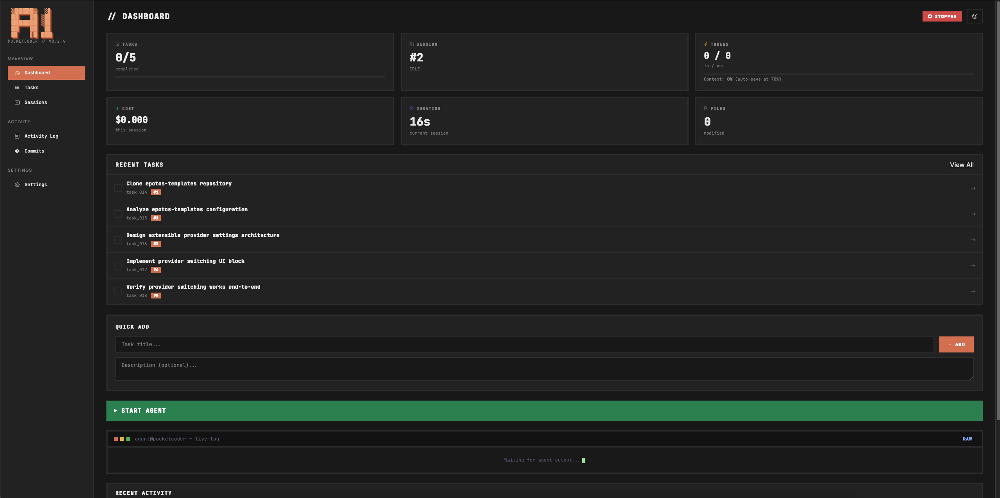
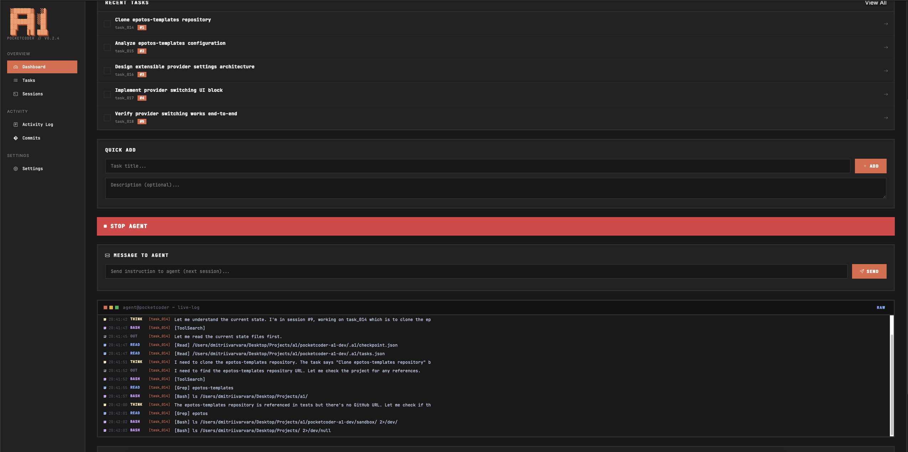
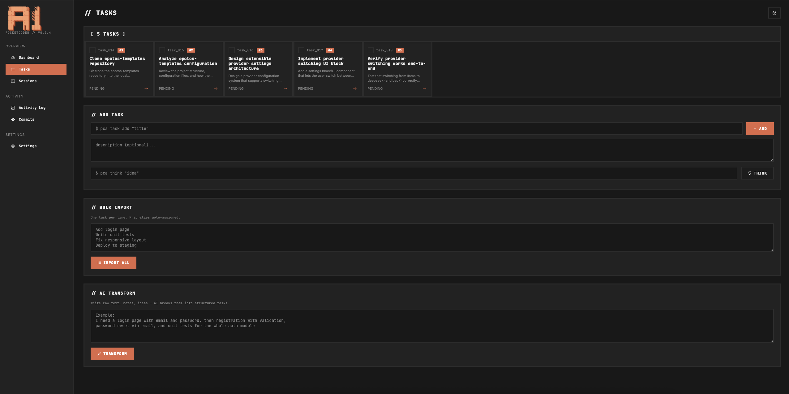
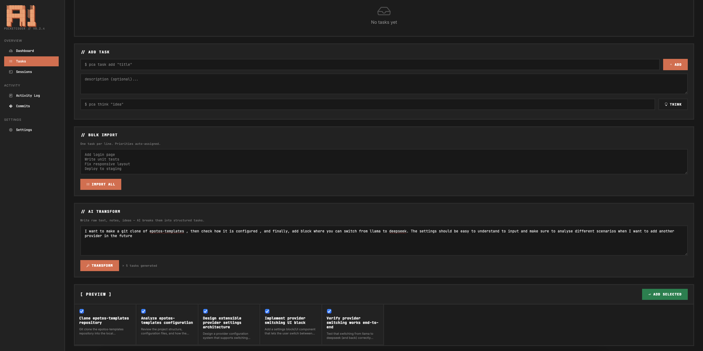
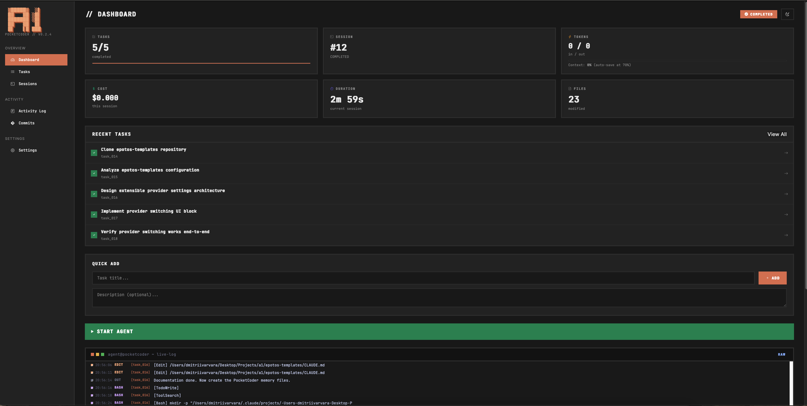
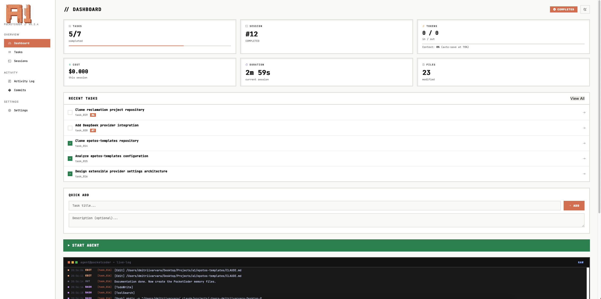

# PocketCoder-A1

**Autonomous Coding Agent with Web Dashboard**

Write tasks before bed, press Start, wake up to results. A1 works autonomously — runs code, verifies output, takes the next task. Real-time dashboard shows everything.

7086 lines of Python. Zero frameworks. 3 providers. Verification that catches a lying agent.



---

## Install

```bash
pip install pocketcoder-a1
```

Also need [Claude Code CLI](https://docs.anthropic.com/en/docs/claude-code):
```bash
npm i -g @anthropic-ai/claude-code
```

**Requirements:** Python 3.10+, Node.js 18+

Full step-by-step guide: **[GETTING_STARTED.md](GETTING_STARTED.md)**

---

## Quick Start

```bash
# 1. Create venv
python3 -m venv .venv
source .venv/bin/activate

# 2. Install
pip install pocketcoder-a1

# 3. Init on your project
cd /path/to/your-project
pca init .

# 4. Add tasks
pca task add "Add /api/health endpoint"
pca task add "Write unit tests for auth"

# 5. Launch dashboard
pca ui
# Opens http://localhost:7331
```

---

## Dashboard

8 pages, 24 API endpoints, everything in one Python file.

### Live Agent Log

Watch what Claude does in real-time. Every file read, edit, bash command — with colored icons.



### Tasks with Drag-and-Drop

Cards with priorities, statuses, success criteria. Drag to reorder.



### AI Transform

Paste messy notes in free form. AI breaks them into structured tasks with descriptions and criteria.



### Completed

5/5 tasks done. 12 sessions. 23 files modified. All verified.



### Light Theme



---

## How It Works

```
You add tasks → Start Agent → Agent works autonomously
                                    ↓
                              Takes next task
                                    ↓
                              Writes code (Claude CLI subprocess)
                                    ↓
                              Verifies result ← "Don't trust, verify"
                              (pytest, py_compile, files on disk)
                                    ↓
                         PASS → next task    FAIL → retry (max 5)
                                    ↓
                              All done → COMPLETED
```

### Verification: "Don't Trust, Verify"

Agent says "COMPLETED"? We don't believe it. Three-tier check:

| Tier | Type | Checks |
|------|------|--------|
| 1 | **BLOCKING** | py_compile, pytest, files exist, success criteria |
| 2 | **WARNING** | ruff, build, git diff |
| 3 | **ANTI-LOOP** | baseline comparison, max 5 retries, force accept |

Caught the agent lying about completion with failing tests. This system prevents that.

---

## Providers

| Provider | Command | Requires |
|----------|---------|----------|
| **claude-max** | `pca start` | Claude Max subscription |
| **claude-api** | `pca start --provider claude-api` | Anthropic API key |
| **ollama** | `pca start --provider ollama` | Local Ollama server |

Configure in dashboard: **Settings** page.

---

## CLI Commands

| Command | What it does |
|---------|-------------|
| `pca init .` | Initialize project |
| `pca task add "..."` | Add task |
| `pca tasks` | Show all tasks |
| `pca start` | Start autonomous agent |
| `pca start --task task_001` | Work on single task |
| `pca status` | Current status |
| `pca validate` | Run validation checks |
| `pca ui` | Launch dashboard (:7331) |
| `pca config` | View settings |
| `pca config set provider ollama` | Change provider |
| `pca log` | Session history |
| `pca test` | Run E2E vision tests |

---

## Dashboard Pages

| Page | URL | What |
|------|-----|------|
| Dashboard | `/` | 6 metric cards, Start/Stop, live log, Quick Add |
| Tasks | `/tasks` | List + drag-and-drop + bulk add + AI Transform |
| Task Detail | `/task/{id}` | Full view + logs + Start/Stop/Delete |
| Sessions | `/sessions` | Session history with metrics |
| Activity Log | `/log` | Timeline of actions |
| Settings | `/settings` | Provider, API key, parameters |
| Commits | `/commits` | Git history |
| Transform | `/transform` | Free text → structured tasks via AI |

### 6 Metric Cards

| Card | Example |
|------|---------|
| Tasks | `2/5 done` + progress bar |
| Session | `#3` + WORKING badge |
| Tokens | `12.4K in / 3.2K out` |
| Cost | `$0.08` |
| Duration | `48s` (live timer) |
| Files | `3 modified` |

---

## Project Structure

```
a1/
├── loop.py        (1219)  # Brain: subprocess → stream-json → verify
├── dashboard.py   (3491)  # Web UI: 8 pages, 24 API, inline HTML/CSS/JS
├── validator.py    (361)  # Eyes: syntax, tests, lint, build, criteria
├── cli.py          (387)  # CLI: pca init/task/start/ui/test/config
├── config.py       (126)  # Settings: CLI > env > config.json > defaults
├── tasks.py        (236)  # Tasks: CRUD, priority, reorder, criteria
├── checkpoint.py   (173)  # State: session, status, metrics, decisions
└── tester/        (1087)  # Vision QA: Playwright + Claude Vision
```

---

## API

Full REST API — 24 endpoints. Monitor from scripts:

```bash
# Current status
curl http://localhost:7331/api/status | python -m json.tool

# Agent log
curl "http://localhost:7331/api/log?since=0" | python -m json.tool

# Add task
curl -X POST http://localhost:7331/add-task -d "task=Fix+the+bug&description=details"
```

---

## Links

- [Habr article (RU)](https://habr.com/ru/articles/991022/) — PocketCoder v1
- [Telegram](https://t.me/notes_from_cto)
- [BVMax](https://bvmax.ru/ai)

## License

MIT
