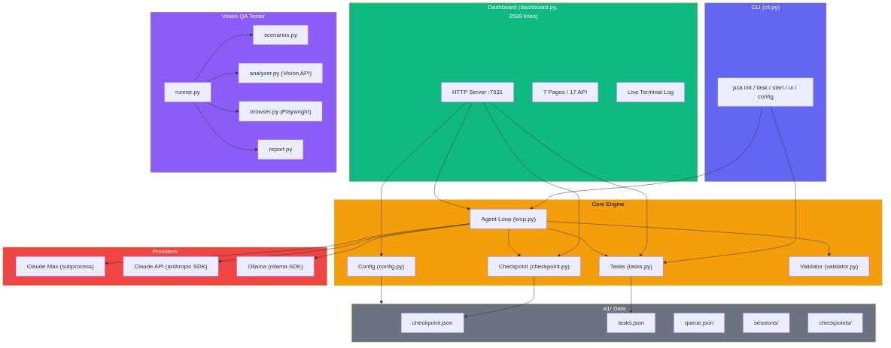
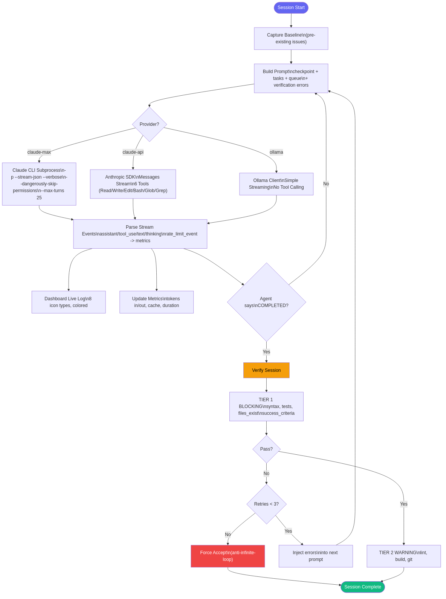
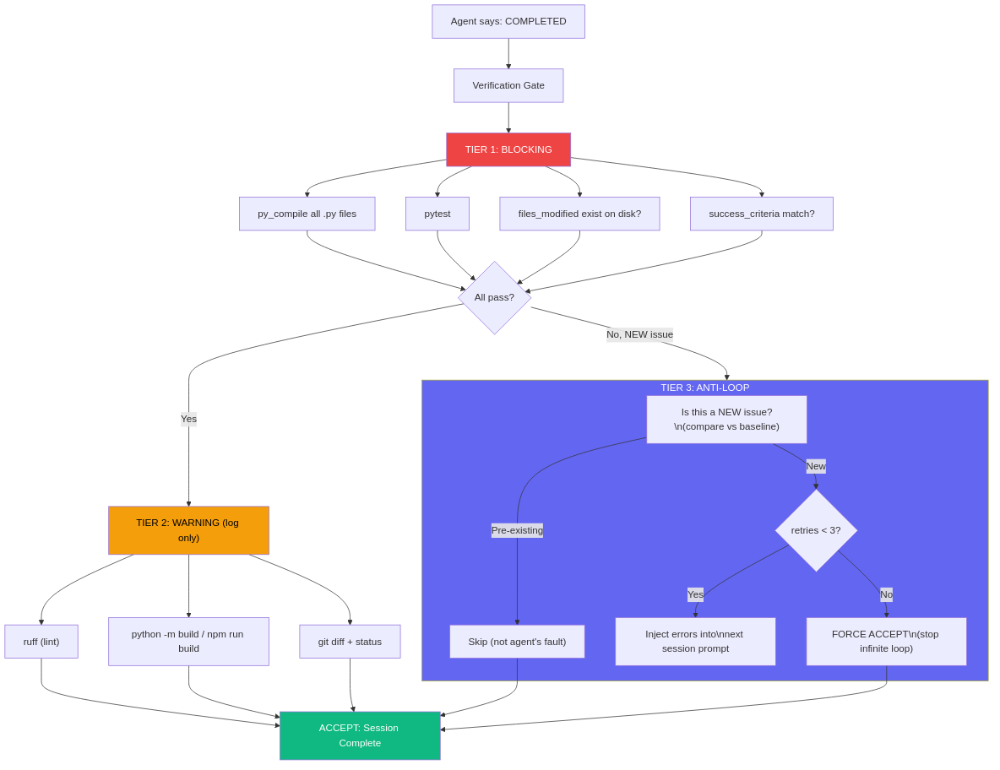
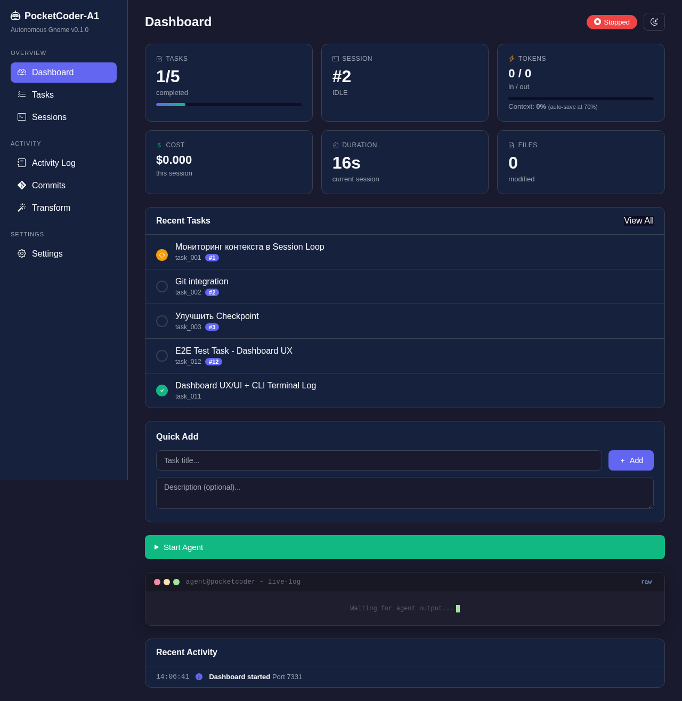
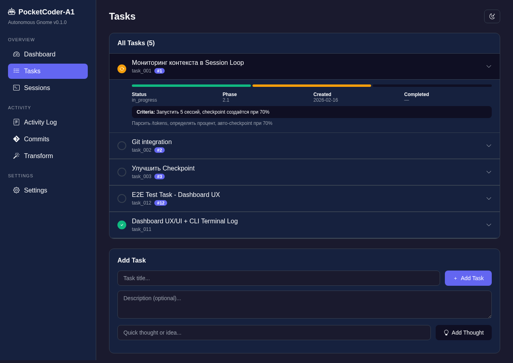
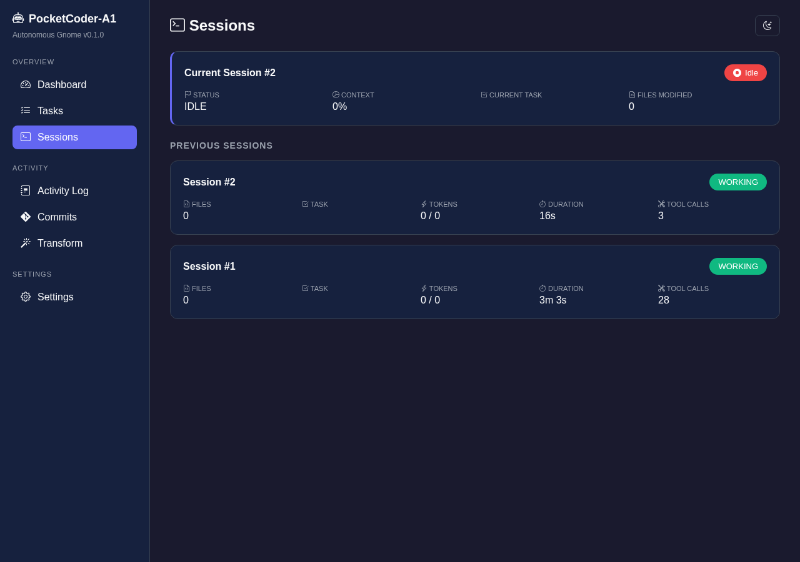
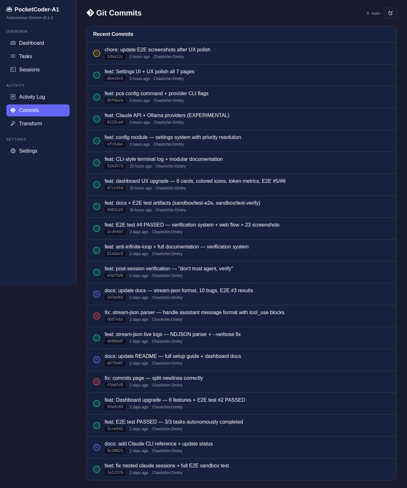
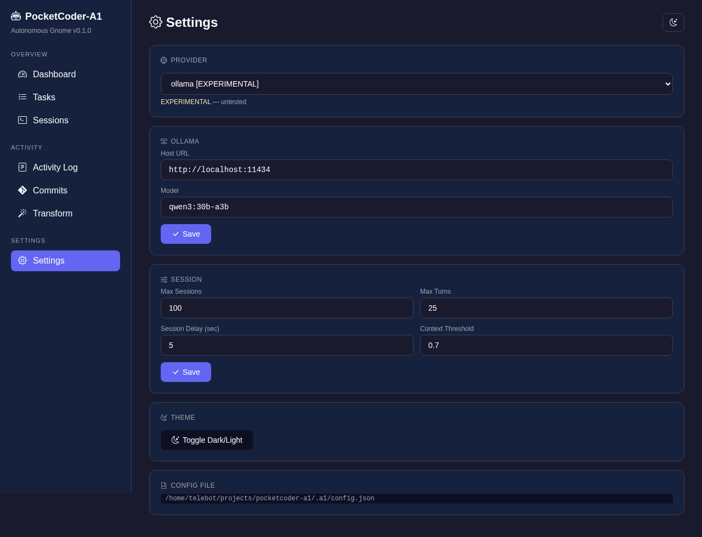
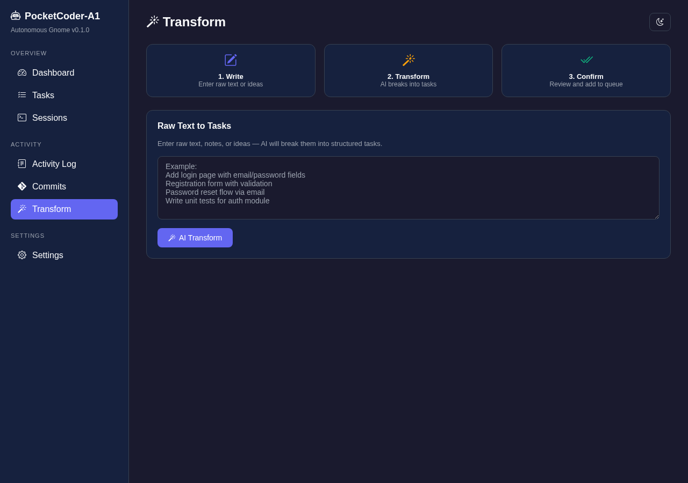

# Building an Autonomous Coding Agent That Doesn't Trust Itself

> Or why your AI agent lies to your face, and what to do about it.

---

I have to admit something embarrassing - we actually caught our agent lying. It wrote `"status": "COMPLETED"` in the checkpoint file, but the tests weren't passing. Files it claimed to have "created" didn't exist on disk. We spent a week teaching the agent not to lie.

That's how **PocketCoder-A1** was born - an autonomous coding agent with built-in verification, a web dashboard, and multi-provider support. In this article - the full story: architecture, 13 bugs we found, a Live Demo with screenshots, and why "don't trust the agent" isn't paranoia but engineering discipline.

---

## Table of Contents

1. [Why this exists](#1-why-this-exists)
2. [Architecture: 13 modules, 5000+ lines](#2-architecture)
3. [Agent Loop: the heart of the system](#3-agent-loop)
4. [Verification: "Don't trust, verify"](#4-verification)
5. [Web Dashboard: 7 pages, no frameworks](#5-web-dashboard)
6. [Providers and configuration](#6-providers-and-configuration)
7. [Stream-JSON: real-time live logs](#7-stream-json)
8. [13 bugs we found](#8-bugs)
9. [Live Demo: from empty project to results](#9-live-demo)
10. [E2E testing: 6 tests passed](#10-e2e-testing)
11. [Conclusions and what's next](#11-conclusions)

---

## 1. Why this exists

You know that feeling when you open Claude Code, give it a task, it works on it, then the context runs out - and you start over? Explaining the same project, the same files, the same architecture. Every time.

We wanted a simple thing - press a button, go grab coffee, come back to working code. But not just "the agent wrote something and said it's done" - with actual verification. Because, as we discovered, the agent can say "COMPLETED" when nothing actually works.

PocketCoder-A1 solves three problems. First - autonomy: the agent works in sessions, saves state between them, picks up the next task automatically. Second - verification: after each session, a three-tier check runs, and if something's wrong, the agent gets the errors in its next prompt and tries to fix them. Third - observability: the web dashboard shows in real time what the agent is doing, which files it reads, how many tokens it spends.

---

## 2. Architecture

The entire project is 13 Python modules and roughly 5300 lines of code. Zero frameworks. The HTTP server is built on standard `http.server`, JSON parsing uses standard `json`, file operations use `pathlib`. The only external dependencies are `playwright` for E2E tests and optionally `anthropic` and `ollama` for alternative providers.



The file structure looks like this:

```
a1/                              # 4200+ lines of core code
├── __init__.py           (6)    # Version 0.1.0
├── loop.py             (1151)   # Brain: subprocess -> stream-json -> verify -> metrics
├── dashboard.py        (2589)   # Web UI: 7 pages, 17 API, 6 cards, live log
├── validator.py         (361)   # Eyes: syntax, tests, lint, build, git, criteria
├── cli.py               (368)   # CLI: pca init/task/start/status/ui/config
├── config.py            (126)   # Settings: priorities CLI > env > config > defaults
├── tasks.py             (211)   # Tasks: CRUD, priority, reorder, criteria
├── checkpoint.py        (146)   # State: session, status, metrics, decisions
└── tester/             (1087)   # Vision QA agent
    ├── runner.py        (419)   # Main loop: scenario -> steps -> screenshot -> analyze
    ├── scenarios.py     (203)   # 7 test scenarios
    ├── report.py        (193)   # HTML/JSON reports
    ├── analyzer.py      (142)   # Claude Vision API
    └── browser.py       (124)   # Playwright wrapper
```

The largest module is `dashboard.py` at 2589 lines. It's a full web server with 7 pages and 17 API endpoints, written without a single framework. All CSS, HTML, and JavaScript are generated directly in Python through `string.Template`. Sounds insane, but it works perfectly - zero dependencies, instant startup, one file.

The second largest is `loop.py` at 1151 lines. This is the brain of the system: it launches Claude as a subprocess, parses the NDJSON stream in real time, updates metrics, and after each session kicks off verification.

---

## 3. Agent Loop

Here's what happens when you click "Start Agent" on the dashboard or run `pca start`:



The core of the system is launching Claude CLI as a subprocess. Sounds simple, but we found 9 bugs just in this part. Here's what the final launch looks like:

```python
import os, subprocess

env = os.environ.copy()
env.pop("CLAUDECODE", None)  # BUG #3: without this, nested sessions crash

proc = subprocess.Popen(
    ["claude", "-p", prompt,                    # BUG #1: forgot the -p flag
     "--dangerously-skip-permissions",           # BUG #4: without this, agent waits for confirmation
     "--no-session-persistence",
     "--max-turns", str(self.max_turns),         # BUG #5: without a limit, agent runs forever
     "--verbose",                                # BUG #9: without this, stream-json doesn't work with -p
     "--output-format", "stream-json"],
    cwd=str(project_dir),
    env=env,
    stdout=subprocess.PIPE,                      # BUG #2: without this, no output captured
    stderr=subprocess.STDOUT,
    text=True,
    bufsize=1,
)
```

Every comment in the code is a bug that cost us between 30 minutes and 2 hours to find. The sneakiest one is `env.pop("CLAUDECODE", None)`. Claude Code sets a `CLAUDECODE=1` environment variable. If you launch `claude` as a subprocess inside Claude Code, it detects this variable and crashes with "cannot launch inside another session". The fix is one line, but finding the cause was hard.

The prompt the agent receives is assembled from several sources: the current checkpoint (which session, what status), the task list with priorities (the agent takes the task with the lowest priority number), queued messages (if the user sent something through the dashboard), and most importantly - verification errors from the previous session. If the agent said "COMPLETED" but tests failed, it will see this in its next prompt.

---

## 4. Verification: "Don't trust, verify"

This is the most important part of the system. And the most interesting.



When the agent says "COMPLETED", we don't believe it. A three-tier check kicks in.

**First tier - BLOCKING.** If any check fails, the session is not accepted. This includes `py_compile` on all Python files (syntax), `pytest` (tests), verifying that files from `files_modified` actually exist on disk, and checking `success_criteria` from the task. This is the minimum bar - without passing these, work cannot be considered done.

**Second tier - WARNING.** Checks run but results are only logged. This includes `ruff` (linter), `python -m build` or `npm run build` (build), and `git diff` (what changed). Warnings don't block acceptance but appear in the log.

**Third tier - ANTI-LOOP.** This protects against infinite loops. Before the first session, we capture a "baseline" - a snapshot of all pre-existing issues. If the project already had 3 linter errors before our agent touched it, we don't blame the agent for those 3 errors. Only NEW issues count. And if the agent can't fix a problem in 3 attempts, we force-stop (`force_accept`) to avoid spinning forever.

The cause-effect chain looks like this:

```
Agent says "COMPLETED"
  └── _verify_session()
      ├── TIER 1 BLOCKING (must pass):
      │   ├── syntax: py_compile all .py
      │   ├── tests: pytest
      │   ├── files_exist: checkpoint files on disk?
      │   └── success_criteria: heuristic match
      │
      ├── TIER 2 WARNING (log only):
      │   ├── lint: ruff
      │   ├── build: python -m build / npm run build
      │   └── git: diff + status
      │
      └── TIER 3 ANTI-LOOP:
          ├── Baseline: pre-existing issues don't count
          ├── Max 3 retries -> force_accept
          └── Errors -> next session prompt
```

One of the most interesting bugs we found right here. Bug #12: the `success_criteria` check did `.lower()` on the criteria string before comparison. Seems logical - case-insensitive matching. But on Linux the filesystem is case-sensitive. The criteria "Create HealthCheck.py" became "create healthcheck.py" - and the file `HealthCheck.py` wasn't found. Fix: regex-match on the original string, without `.lower()`.

---

## 5. Web Dashboard

The dashboard is 2589 lines of pure Python. No React, no Vue, not even Flask. Standard `http.server.BaseHTTPRequestHandler` with `string.Template` for HTML.



The main page has 6 metric cards. Tasks shows progress (2/5 done) with a progress bar. Session shows the current session number and status. Tokens shows input and output tokens with context usage percentage. Cost shows approximate session cost in dollars. Duration has a live timer (JavaScript updates every second). Files shows the count of modified files.

Below the cards - a list of recent tasks, a quick-add form, a Start/Stop button, a terminal log styled like macOS Terminal (with the red-yellow-green dots and monospace font), and a Recent Activity block.

| Page | URL | What it does |
|------|-----|-------------|
| Dashboard | `/` | 6 cards, Start/Stop, live log |
| Tasks | `/tasks` | List + DnD + expandable details |
| Sessions | `/sessions` | Session history with metrics |
| Activity Log | `/log` | Action timeline |
| Commits | `/commits` | Git history with type icons |
| Transform | `/transform` | Text -> tasks via AI |
| Settings | `/settings` | Provider, API key, Ollama, parameters |



On the Tasks page, each task is clickable - it expands a detail block with stage progress bars, phase, success criteria, and dates. Tasks can be reordered via drag-and-drop to change priority. Priority is shown as a colored badge (#1, #2, #3...).



The Sessions page shows the current session (highlighted with an accent stripe on the left) and the history of previous ones. Each session card displays 5 metrics: files, task, tokens (in/out), duration, and tool call count.



Commits isn't just `git log --oneline`. Each commit gets a colored icon by type: green plus for `feat:`, red bug for `fix:`, blue file for `docs:`, yellow arrow for `refactor:` and `chore:`. Plus the hash in a monospace badge, relative time ("2 hours ago"), and author name.





Transform is an AI helper for turning raw text into structured tasks. Type in "add login, registration, password reset, write tests" - get 4 tasks with descriptions. At the top of the page - a visual 3-step guide: Write, Transform, Confirm.

The terminal log deserves special mention. This isn't just text in a `<pre>` block. Each line is classified by type: READ (blue), EDIT (orange), WRITE (green), BASH (purple), THINK (yellow), TEXT (gray), METRIC (teal), VERIFY (green). Timestamp on the left, type label in the middle, text on the right. Catppuccin Mocha style with dark background #1e1e2e. Updates via AJAX every 2 seconds.

---

## 6. Providers and Configuration

PocketCoder supports three providers. Claude Max is the primary one, working through the Claude CLI subprocess with full tooling. Claude API connects directly to the Anthropic API through the SDK, implementing a full agentic loop with 6 tools (Read, Write, Edit, Bash, Glob, Grep). Ollama runs local models with simple streaming and no tool calling. Claude API and Ollama are marked as EXPERIMENTAL.

Settings are stored in `.a1/config.json` and resolved through a priority chain:

```
CLI flags  >  environment variables  >  config.json  >  defaults
```

For example, an API key can be provided three ways: `pca start --api-key sk-...`, environment variable `ANTHROPIC_API_KEY`, or through the dashboard Settings -> API Key -> Save. CLI has the highest priority.

Through CLI it looks like this:

```bash
pca config                           # show all settings
pca config set provider ollama       # switch provider
pca start --provider claude-api      # one-time override via flag
pca start --ollama-model qwen3:30b   # choose model
```

---

## 7. Stream-JSON: real-time live logs

One of the most frustrating problems during development - we launched the dashboard, clicked Start Agent, and... nothing. The log was empty. The agent seemed to be working (process existed), but not a single line of output.

The cause was buffering. Claude CLI in `-p` (print mode) buffers all output until the process finishes. `readline()` blocks and waits. The solution is the `--output-format stream-json` flag together with `--verbose`. Without `--verbose`, stream-json doesn't work with `-p` - this is an undocumented quirk of Claude CLI that cost us 2 hours.

With stream-json, Claude outputs NDJSON - one JSON object per line. Here are real examples:

```json
{"type":"assistant","message":{"content":[{"type":"tool_use","name":"Read","input":{"file_path":"/src/app.py"}}]}}
{"type":"assistant","message":{"content":[{"type":"text","text":"I'll fix the bug in line 42..."}]}}
{"type":"assistant","message":{"content":[{"type":"thinking","thinking":"Let me analyze the error..."}]}}
{"type":"rate_limit_event","usage":{"input_tokens":12400,"output_tokens":3200,"cache_read_input_tokens":8000}}
{"type":"result","result":"Task completed successfully."}
```

The parser in `loop.py` classifies each event and sends it to the dashboard with the appropriate type. `tool_use` with name `Read` becomes type "read" (blue). `tool_use` with name `Bash` becomes "bash" (purple). `text` becomes "text" (gray). `thinking` becomes "thinking" (yellow). `rate_limit_event` updates metrics (tokens, cost).

---

## 8. 13 bugs we found

Every bug on this list is a separate debugging story. Here are the top 5 most interesting ones, with the full table below.

**Bug #3: Nested sessions crash.** Claude Code sets `CLAUDECODE=1` in the environment. Our subprocess inherits this. The inner `claude` sees the variable and refuses to start: "cannot launch inside another session". Fix - one line: `env.pop("CLAUDECODE", None)`. But finding the cause took 2 hours because the error didn't appear in stdout.

**Bug #9: --verbose is mandatory.** We added `--output-format stream-json` and expected an NDJSON stream. Got silence. Turns out, with the `-p` flag (non-interactive mode), stream-json requires `--verbose`. Without it - nothing. This is documented nowhere.

**Bug #10: Event format mismatch.** The stream-json documentation mentions `content_block_start` events. In reality, tool_use comes inside `assistant` messages in the `content[]` array. We were looking for `content_block_start` and finding nothing. Rewrote the parser after reading actual output.

**Bug #12: Case-sensitive filesystem.** The validator did `.lower()` on success_criteria before checking. "Create HealthCheck.py" became "create healthcheck.py". On Linux, the file `HealthCheck.py` wasn't found. Fix - regex-match on the original string.

**Bug #13: $ in JavaScript inside Template.** Python `string.Template` uses `$variable` for substitution. Our JavaScript code contained `$0.00` to display cost. Template interpreted `$0` as a variable and crashed. Fix - escaping: `$$0.00`.

Full table:

| # | File | Bug | Fix |
|---|------|-----|-----|
| 1 | loop.py | CLI args missing `-p` | Added `-p` flag |
| 2 | loop.py | No output capture | `stdout=subprocess.PIPE` |
| 3 | loop.py | Nested session crash | `env.pop("CLAUDECODE")` |
| 4 | loop.py | No auto-permissions | `--dangerously-skip-permissions` |
| 5 | loop.py | Infinite execution | `--max-turns 25` |
| 6 | loop.py | signal in thread | Check `threading.current_thread()` |
| 7 | loop.py | Agent doesn't know file formats | HOW TO UPDATE in prompt |
| 8 | dashboard.py | XSS + stop broken | `html.escape()` + `loop.stop()` |
| 9 | loop.py | stream-json empty | Added `--verbose` |
| 10 | loop.py | Wrong event format | tool_use in content[] |
| 11 | loop.py | f-string nested quotes | Extracted to variable |
| 12 | validator.py | Case-sensitive criteria | Regex on original string |
| 13 | dashboard.py | `$` in JS Template | Escaped as `$$` |

---

## 9. Live Demo

Here's what a full work cycle looks like. Say we have an empty project and three tasks.

Step 0: Initialization.

```bash
pip install -e .
mkdir my-project && cd my-project
pca init .
```

This creates the `.a1/` directory with empty `tasks.json` and `checkpoint.json`.

Step 1: Add tasks. Either through CLI (`pca task add "Create health endpoint"`) or through the dashboard. Launch the dashboard:

```bash
pca ui
```

The browser opens at `http://localhost:7331`. Fill in the Quick Add form - title and description. Add 3 tasks.

Step 2: Start the agent.

```bash
pca start
```

Or click "Start Agent" on the dashboard. The agent takes the task with the lowest priority, builds the prompt, launches Claude.

Step 3: Watch. In the dashboard's terminal log, lines appear in real time - READ (agent reading files), WRITE (creating), BASH (running commands), THINK (reasoning). Cards update: tokens growing, timer ticking.

Step 4: Verification. Agent says "COMPLETED". The 3-tier check runs. If everything's fine - the task is marked done, agent takes the next one. If not - errors go into the next session's prompt.

Step 5: Done. All tasks completed. Dashboard shows "Completed" with a green badge. Sessions page shows all sessions with metrics.

---

## 10. E2E Testing

We ran 6 E2E tests - all passed.

| # | Test | Tasks | Checks | Time |
|---|------|-------|--------|------|
| 1 | Basic cycle | 3/3 | 10 screenshots | 90s |
| 2 | Real project (epotos) | 3/3 | 36 screenshots | 150s |
| 3 | Stream-JSON verify | 1/1 | 23 log entries | 60s |
| 4 | Verification system | 4/4 | 23 pytest tests | 48s |
| 5 | Dashboard UX | - | 77/77 checks | - |
| 6 | Full cycle (web->agent->done) | 3/3 | 22/22 checks | 165s |

Test #6 is the most comprehensive. Adding tasks through Playwright web forms, starting the agent, parallel monitoring (screenshots every 15 seconds + API checks + file reads), final verification at 5 levels. More about the testing methodology in a separate article.

---

## 11. Conclusions and what's next

PocketCoder-A1 is 5300+ lines of Python, 13 modules, 7 dashboard pages, 17 API endpoints, 3 providers, 6 E2E tests. All without frameworks. Installation is `pip install -e .` and one command.

What works well: autonomous sessions (press Start, leave, come back to results), verification (actually catches the lying agent), dashboard (see everything in real time).

What's still in progress: automatic checkpoint at 70% context (so the agent doesn't lose work when context overflows), git integration (automatic branches and atomic commits), more providers (OpenAI-compatible endpoints).

---

**GitHub**: [github.com/Chashchin-Dmitry/pocketcoder-a1](https://github.com/Chashchin-Dmitry/pocketcoder-a1)

**Installation**:
```bash
pip install -e .
pca init my-project
pca ui
```

If you've read this far - thank you. I'd appreciate a star on GitHub and feedback in Issues.
