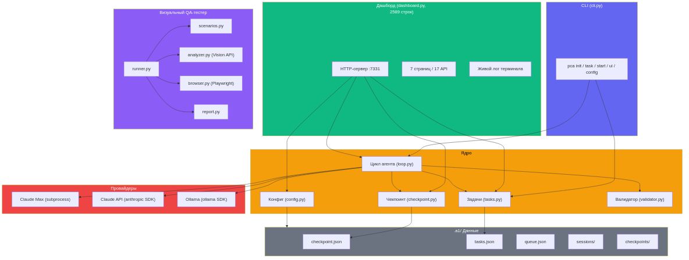
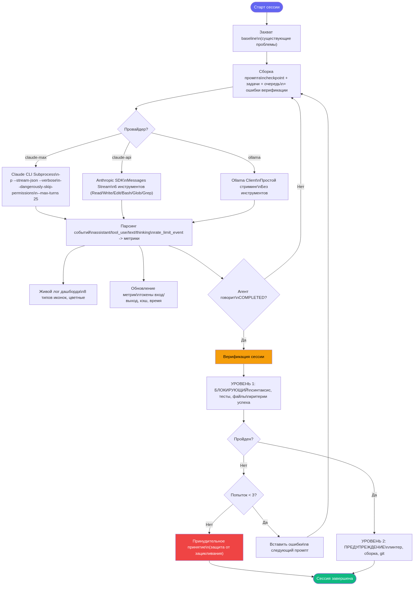
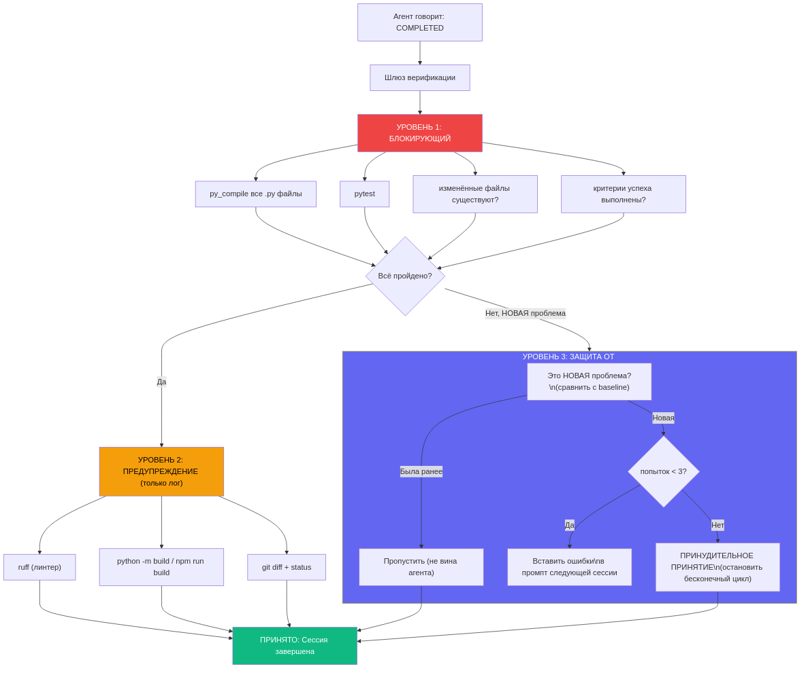

# Как мы сделали автономного агента-кодера, который не верит сам себе

> Или почему ваш AI-агент врёт вам в лицо, и что с этим делать.

---

Стыдно признаться, но мы реально поймали нашего агента на лжи. Он написал в checkpoint: `"status": "COMPLETED"`, а тесты при этом не проходили. Файлы, которые он "создал" - не существовали на диске. Мы потратили неделю на то, чтобы научить агента не врать.

Так появился **PocketCoder-A1** - автономный coding agent с встроенной верификацией, веб-дашбордом и поддержкой нескольких провайдеров. В этой статье - полная история: архитектура, 13 багов которые мы нашли, Live Demo со скриншотами, и почему "не верить агенту" - это не паранойя, а инженерная практика.

---

## Содержание

1. [Зачем это вообще нужно](#1-зачем-это-вообще-нужно)
2. [Архитектура: 13 модулей, 5000+ строк](#2-архитектура)
3. [Agent Loop: сердце системы](#3-agent-loop)
4. [Верификация: "Не верим на слово"](#4-верификация)
5. [Web Dashboard: 7 страниц без фреймворков](#5-web-dashboard)
6. [Провайдеры и настройки](#6-провайдеры-и-настройки)
7. [Stream-JSON: живые логи в реальном времени](#7-stream-json)
8. [13 багов, которые мы нашли](#8-баги)
9. [Live Demo: от пустого проекта до результата](#9-live-demo)
10. [E2E тестирование: 6 тестов](#10-e2e)
11. [Выводы и что дальше](#11-выводы)

---

## 1. Зачем это вообще нужно

Знаете это чувство, когда открываешь Claude Code, даёшь ему задачу, он делает, потом контекст кончается - и ты начинаешь заново? Объясняешь тот же проект, те же файлы, ту же архитектуру. Каждый раз.

Мы хотели простую вещь - нажать кнопку, уйти пить кофе, вернуться к готовому коду. Но не просто "агент написал и сказал что готово", а с реальной проверкой. Потому что, как мы выяснили, агент может сказать "COMPLETED" когда ничего не работает.

PocketCoder-A1 решает три проблемы. Первая - автономность: агент работает сессиями, сохраняет состояние между ними, сам берёт следующую задачу. Вторая - верификация: после каждой сессии запускается трёхуровневая проверка, и если что-то не так - агент получает ошибки в следующий промпт и пытается исправить. Третья - наблюдаемость: веб-дашборд показывает в реальном времени что агент делает, какие файлы читает, сколько токенов тратит.

---

## 2. Архитектура

Весь проект - это 13 Python-модулей и примерно 5300 строк кода. Ни одного фреймворка. HTTP-сервер написан на стандартном `http.server`, парсинг JSON - стандартный `json`, работа с файлами - `pathlib`. Единственные внешние зависимости - `playwright` для E2E тестов и опционально `anthropic` и `ollama` для альтернативных провайдеров.



Структура файлов выглядит так:

```
a1/                              # 4200+ строк основного кода
├── __init__.py           (6)    # Версия 0.1.0
├── loop.py             (1151)   # Мозг: subprocess -> stream-json -> verify -> metrics
├── dashboard.py        (2589)   # Web UI: 7 страниц, 17 API, 6 карточек, live log
├── validator.py         (361)   # Глаза: syntax, tests, lint, build, git, criteria
├── cli.py               (368)   # CLI: pca init/task/start/status/ui/config
├── config.py            (126)   # Настройки: приоритеты CLI > env > config > defaults
├── tasks.py             (211)   # Задачи: CRUD, приоритет, reorder, criteria
├── checkpoint.py        (146)   # Состояние: session, status, metrics, decisions
└── tester/             (1087)   # Vision QA агент
    ├── runner.py        (419)   # Главный цикл: сценарий -> шаги -> скриншот -> анализ
    ├── scenarios.py     (203)   # 7 тестовых сценариев
    ├── report.py        (193)   # HTML/JSON отчёты
    ├── analyzer.py      (142)   # Claude Vision API
    └── browser.py       (124)   # Playwright обёртка
```

Самый большой модуль - `dashboard.py` на 2589 строк. Это полноценный веб-сервер с 7 страницами и 17 API-эндпоинтами, написанный без единого фреймворка. Весь CSS, HTML и JavaScript генерируются прямо в Python через `string.Template`. Звучит безумно, но работает отлично - ноль зависимостей, мгновенный запуск, один файл.

Второй по размеру - `loop.py` на 1151 строку. Это мозг системы: он запускает Claude как subprocess, парсит NDJSON-поток в реальном времени, обновляет метрики, и после каждой сессии запускает верификацию.

---

## 3. Agent Loop

Вот что происходит, когда вы нажимаете "Start Agent" на дашборде или запускаете `pca start`:



Ядро системы - это запуск Claude CLI как subprocess. Звучит просто, но мы нашли 9 багов только в этой части. Вот как выглядит финальный вариант запуска:

```python
import os, subprocess

env = os.environ.copy()
env.pop("CLAUDECODE", None)  # БАГ #3: без этого nested sessions падают

proc = subprocess.Popen(
    ["claude", "-p", prompt,                    # БАГ #1: забыли -p флаг
     "--dangerously-skip-permissions",           # БАГ #4: без этого агент ждёт подтверждения
     "--no-session-persistence",
     "--max-turns", str(self.max_turns),         # БАГ #5: без лимита агент работает вечно
     "--verbose",                                # БАГ #9: без этого stream-json не работает с -p
     "--output-format", "stream-json"],
    cwd=str(project_dir),
    env=env,
    stdout=subprocess.PIPE,                      # БАГ #2: без этого нет вывода
    stderr=subprocess.STDOUT,
    text=True,
    bufsize=1,
)
```

Каждый комментарий в коде - это баг, на который мы потратили от 30 минут до 2 часов. Самый коварный - `env.pop("CLAUDECODE", None)`. Claude Code устанавливает переменную `CLAUDECODE=1` в окружении. Если запустить `claude` как subprocess внутри Claude Code - он обнаружит эту переменную и упадёт с ошибкой "cannot launch inside another session". Решение элементарное, но найти причину было непросто.

Промпт, который получает агент, формируется из нескольких источников. Это текущий checkpoint (какая сессия, какой статус), список задач с приоритетами (агент берёт задачу с наименьшим номером приоритета), сообщения из очереди (если пользователь отправил что-то через дашборд), и - самое важное - ошибки верификации из предыдущей сессии. Если агент сказал "COMPLETED", но тесты упали - он увидит это в следующем промпте.

---

## 4. Верификация: "Не верим на слово"

Это самая важная часть системы. И самая интересная.



Когда агент говорит "COMPLETED", мы не верим. Запускается трёхуровневая проверка.

**Первый уровень - BLOCKING.** Если хоть одна проверка не прошла, сессия не принимается. Сюда входит `py_compile` на все Python-файлы (синтаксис), `pytest` (тесты), проверка что файлы из `files_modified` реально существуют на диске, и проверка `success_criteria` из задачи. Это минимум, без которого нельзя считать работу выполненной.

**Второй уровень - WARNING.** Проверки запускаются, но результат только логируется. Это `ruff` (линтер), `python -m build` или `npm run build` (сборка), и `git diff` (что изменилось). Предупреждения не блокируют принятие, но попадают в лог.

**Третий уровень - ANTI-LOOP.** Это защита от бесконечного цикла. Перед первой сессией мы делаем "baseline" - снимок всех существующих проблем. Если проект уже имел 3 ошибки линтера до нашего агента, мы не будем винить агента за эти 3 ошибки. Считаются только НОВЫЕ проблемы. И если агент не может исправить проблему за 3 попытки - мы принудительно останавливаемся (`force_accept`), чтобы не крутиться вечно.

Причинно-следственная цепочка выглядит так:

```
Агент говорит "COMPLETED"
  └── _verify_session()
      ├── TIER 1 BLOCKING (должно пройти):
      │   ├── syntax: py_compile все .py
      │   ├── tests: pytest
      │   ├── files_exist: файлы из checkpoint на диске?
      │   └── success_criteria: heuristic match
      │
      ├── TIER 2 WARNING (только лог):
      │   ├── lint: ruff
      │   ├── build: python -m build / npm run build
      │   └── git: diff + status
      │
      └── TIER 3 ANTI-LOOP:
          ├── Baseline: старые проблемы не считаются
          ├── Max 3 retry → force_accept
          └── Ошибки → следующий промпт агента
```

Один из самых интересных багов мы нашли именно здесь. Баг #12: проверка `success_criteria` делала `.lower()` на строке критерия перед сравнением. Казалось бы, логично - case-insensitive matching. Но на Linux файловая система case-sensitive. Критерий "pytest passes" превращался в "pytest passes" (без изменений), а вот критерий "Create HealthCheck.py" превращался в "create healthcheck.py" - и файл `HealthCheck.py` не находился. Решение: делать regex-match на оригинальной строке, без `.lower()`.

---

## 5. Web Dashboard

Дашборд - это 2589 строк чистого Python. Ни React, ни Vue, ни даже Flask. Стандартный `http.server.BaseHTTPRequestHandler` с `string.Template` для HTML.


На главной странице 6 метрик-карточек. Tasks показывает прогресс (2/5 done) с progress bar. Session - номер текущей сессии и статус. Tokens - входящие и исходящие токены с процентом использования контекста. Cost - приблизительная стоимость сессии в долларах. Duration - время с live-таймером (JavaScript обновляет каждую секунду). Files - количество изменённых файлов.

Ниже карточек - список последних задач, форма быстрого добавления, кнопка Start/Stop, терминальный лог в стиле macOS Terminal (с точками красная-жёлтая-зелёная и моноширинным шрифтом), и блок Recent Activity.

| Страница | URL | Что делает |
|----------|-----|------------|
| Dashboard | `/` | 6 карточек, Start/Stop, live log |
| Tasks | `/tasks` | Список + DnD + развернуть детали |
| Sessions | `/sessions` | История сессий с метриками |
| Activity Log | `/log` | Временная шкала действий |
| Commits | `/commits` | Git история с иконками типов |
| Transform | `/transform` | Текст -> задачи через AI |
| Settings | `/settings` | Провайдер, API ключ, Ollama, параметры |


На странице Tasks каждая задача кликабельная - раскрывается блок с деталями: прогресс-бар по стадиям, фаза, критерии успеха, даты. Задачи можно перетаскивать drag-and-drop для изменения приоритета. Приоритет отображается цветным бейджем (#1, #2, #3...).


Страница Sessions показывает текущую сессию (выделена акцентной полоской слева) и историю предыдущих. Каждая карточка сессии показывает 5 метрик: файлы, задачу, токены (in/out), длительность, количество вызовов инструментов.


Commits - не просто `git log --oneline`. Каждый коммит получает цветную иконку по типу: зелёный плюс для `feat:`, красный баг для `fix:`, синий файл для `docs:`, жёлтая стрелка для `refactor:` и `chore:`. Плюс хэш в моноширинном бейдже, относительное время ("2 hours ago") и имя автора.


Transform - это AI-помощник для превращения сырого текста в структурированные задачи. Вводишь "добавить логин, регистрацию, сброс пароля, написать тесты" - получаешь 4 задачи с описаниями. Наверху страницы - визуальный гайд из 3 шагов: Write, Transform, Confirm.

Терминальный лог заслуживает отдельного упоминания. Это не просто текст в `<pre>` блоке. Каждая строка классифицируется по типу: READ (синий), EDIT (оранжевый), WRITE (зелёный), BASH (фиолетовый), THINK (жёлтый), TEXT (серый), METRIC (голубой), VERIFY (зелёный). Время слева, тип-лейбл посередине, текст справа. Стиль Catppuccin Mocha с тёмным фоном #1e1e2e. Обновляется через AJAX каждые 2 секунды.

---

## 6. Провайдеры и настройки

PocketCoder поддерживает три провайдера. Claude Max - основной, работает через Claude CLI subprocess с полным инструментарием. Claude API - прямое обращение к Anthropic API через SDK, реализован полный agentic loop с 6 инструментами (Read, Write, Edit, Bash, Glob, Grep). Ollama - локальные модели, простой streaming без tool calling. Claude API и Ollama помечены как EXPERIMENTAL.

Настройки хранятся в `.a1/config.json` и разрешаются по цепочке приоритетов:

```
CLI флаги  >  переменные окружения  >  config.json  >  значения по умолчанию
```

Например, API ключ можно передать тремя способами: `pca start --api-key sk-...`, переменная `ANTHROPIC_API_KEY`, или через дашборд Settings → API Key → Save. CLI имеет наивысший приоритет.

Через CLI это выглядит так:

```bash
pca config                           # показать все настройки
pca config set provider ollama       # переключить провайдер
pca start --provider claude-api      # одноразово через флаг
pca start --ollama-model qwen3:30b   # выбрать модель
```

---

## 7. Stream-JSON: живые логи

Одна из самых раздражающих проблем при разработке - мы запустили дашборд, нажали Start Agent, и... ничего. Лог пустой. Агент вроде работает (процесс есть), но ни одной строчки вывода.

Причина оказалась в буферизации. Claude CLI в режиме `-p` (print mode) буферит весь вывод до завершения процесса. `readline()` блокируется и ждёт. Решение - флаг `--output-format stream-json` вместе с `--verbose`. Без `--verbose` stream-json не работает с `-p` - это недокументированная особенность Claude CLI, на которую мы потратили 2 часа.

С stream-json Claude выдаёт NDJSON - по одному JSON-объекту на строку. Вот реальные примеры:

```json
{"type":"assistant","message":{"content":[{"type":"tool_use","name":"Read","input":{"file_path":"/src/app.py"}}]}}
{"type":"assistant","message":{"content":[{"type":"text","text":"I'll fix the bug in line 42..."}]}}
{"type":"assistant","message":{"content":[{"type":"thinking","thinking":"Let me analyze the error..."}]}}
{"type":"rate_limit_event","usage":{"input_tokens":12400,"output_tokens":3200,"cache_read_input_tokens":8000}}
{"type":"result","result":"Task completed successfully."}
```

Парсер в `loop.py` классифицирует каждое событие и отправляет в дашборд с соответствующим типом. `tool_use` с именем `Read` -> тип "read" (синий). `tool_use` с именем `Bash` -> тип "bash" (фиолетовый). `text` -> "text" (серый). `thinking` -> "thinking" (жёлтый). `rate_limit_event` -> обновление метрик (токены, стоимость).

---

## 8. 13 багов, которые мы нашли

Каждый баг в этом списке - отдельная история отладки. Вот топ-5 самых интересных, а ниже полная таблица.

**Баг #3: Nested sessions crash.** Claude Code устанавливает `CLAUDECODE=1` в env. Наш subprocess наследует это окружение. Внутренний `claude` видит переменную и отказывается запускаться: "cannot launch inside another session". Фикс - одна строка: `env.pop("CLAUDECODE", None)`. Но найти причину заняло 2 часа, потому что ошибка не попадала в stdout.

**Баг #9: --verbose обязателен.** Мы добавили `--output-format stream-json` и ожидали NDJSON-поток. Получили пустоту. Оказалось, с флагом `-p` (non-interactive mode) stream-json требует `--verbose`. Без него - тишина. Это нигде не документировано.

**Баг #10: Формат событий.** Документация stream-json говорит про `content_block_start` события. В реальности tool_use приходит внутри `assistant` сообщения в массиве `content[]`. Мы искали `content_block_start` и ничего не находили. Переписали парсер после чтения реального вывода.

**Баг #12: Case-sensitive filesystem.** Validator делал `.lower()` на success_criteria перед проверкой. "Create HealthCheck.py" становилось "create healthcheck.py". На Linux файл `HealthCheck.py` не находился. Фикс - regex-match на оригинальной строке.

**Баг #13: $ в JavaScript внутри Template.** Python `string.Template` использует `$variable` для подстановки. Наш JavaScript код содержал `$0.00` для отображения стоимости. Template интерпретировал `$0` как переменную и падал. Фикс - экранирование: `$$0.00`.

Полная таблица:

| # | Файл | Баг | Фикс |
|---|------|-----|------|
| 1 | loop.py | CLI args без `-p` | Добавили `-p` флаг |
| 2 | loop.py | Нет захвата вывода | `stdout=subprocess.PIPE` |
| 3 | loop.py | Nested session crash | `env.pop("CLAUDECODE")` |
| 4 | loop.py | Нет auto-permissions | `--dangerously-skip-permissions` |
| 5 | loop.py | Бесконечная работа | `--max-turns 25` |
| 6 | loop.py | signal в thread | Проверка `threading.current_thread()` |
| 7 | loop.py | Агент не знает форматы файлов | HOW TO UPDATE в промпте |
| 8 | dashboard.py | XSS + stop broken | `html.escape()` + `loop.stop()` |
| 9 | loop.py | stream-json пустой | Добавили `--verbose` |
| 10 | loop.py | Неверный формат событий | tool_use в content[] |
| 11 | loop.py | f-string nested quotes | Извлекли в переменную |
| 12 | validator.py | Case-sensitive criteria | regex на оригинале |
| 13 | dashboard.py | `$` в JS Template | Экранирование `$$` |

---

## 9. Live Demo

Вот как выглядит полный цикл работы. Допустим, у нас есть пустой проект и три задачи.

Шаг 0: Инициализация.

```bash
pip install -e .
mkdir my-project && cd my-project
pca init .
```

Это создаёт директорию `.a1/` с пустыми `tasks.json` и `checkpoint.json`.

Шаг 1: Добавляем задачи. Можно через CLI (`pca task add "Create health endpoint"`) или через дашборд. Запускаем дашборд:

```bash
pca ui
```

Открывается браузер на `http://localhost:7331`. Заполняем форму Quick Add - title и description. Добавляем 3 задачи.

Шаг 2: Запускаем агента.

```bash
pca start
```

Или нажимаем "Start Agent" на дашборде. Агент берёт задачу с наименьшим приоритетом, формирует промпт, запускает Claude.

Шаг 3: Наблюдаем. В терминальном логе дашборда появляются строки в реальном времени - READ (агент читает файлы), WRITE (создаёт), BASH (запускает команды), THINK (думает). Карточки обновляются: токены растут, таймер тикает.

Шаг 4: Верификация. Агент говорит "COMPLETED". Запускается 3-уровневая проверка. Если всё ок - задача помечается как done, агент берёт следующую. Если нет - ошибки попадают в промпт следующей сессии.

Шаг 5: Готово. Все задачи выполнены. Дашборд показывает "Completed" с зелёным бейджем. В Sessions видны все сессии с метриками.

---

## 10. E2E тестирование

Мы прогнали 6 E2E тестов - все прошли.

| # | Тест | Задачи | Проверки | Время |
|---|------|--------|----------|-------|
| 1 | Basic cycle | 3/3 | 10 скриншотов | 90s |
| 2 | Real project (epotos) | 3/3 | 36 скриншотов | 150s |
| 3 | Stream-JSON verify | 1/1 | 23 лог-записи | 60s |
| 4 | Verification system | 4/4 | 23 pytest теста | 48s |
| 5 | Dashboard UX | - | 77/77 проверок | - |
| 6 | Full cycle (web->agent->done) | 3/3 | 22/22 проверки | 165s |

Тест #6 - самый полный. Добавление задач через веб-формы Playwright, запуск агента, параллельный мониторинг (скриншоты каждые 15 секунд + API-проверки + чтение файлов), финальная верификация на 5 уровнях. Подробнее о методике тестирования - в отдельной статье.

---

## 11. Выводы и что дальше

PocketCoder-A1 - это 5300+ строк Python, 13 модулей, 7 страниц дашборда, 17 API-эндпоинтов, 3 провайдера, 6 E2E тестов. Всё без фреймворков. Установка - `pip install -e .` и одна команда.

Что работает хорошо: автономные сессии (нажал Start, ушёл, вернулся к результату), верификация (реально ловит врущего агента), дашборд (видишь всё в реальном времени).

Что пока в разработке: автоматический checkpoint при 70% контекста (чтобы агент не терял работу при переполнении), git integration (автоматические ветки и atomic commits), больше провайдеров (OpenAI-compatible endpoints).

---

**GitHub**: [github.com/Chashchin-Dmitry/pocketcoder-a1](https://github.com/Chashchin-Dmitry/pocketcoder-a1)

**Установка**:
```bash
pip install -e .
pca init my-project
pca ui
```

Если дочитали до конца - спасибо. Буду рад звезде на GitHub и фидбэку в Issues.
