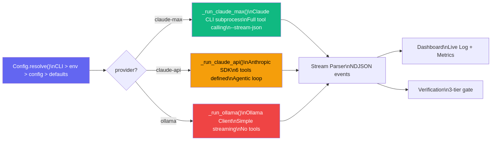
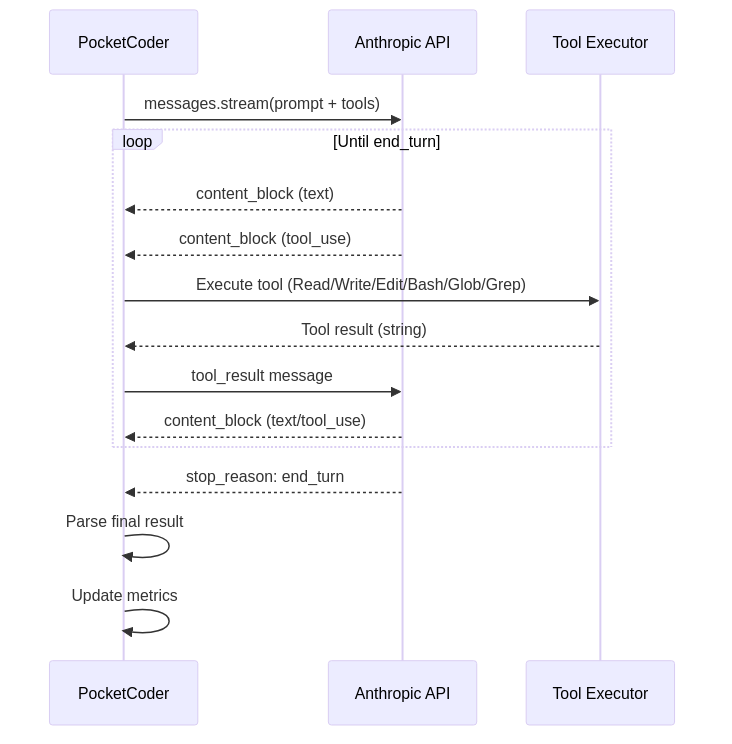

# How We Added Local Models to Our Autonomous Agent and Stopped Fearing API Bills

> Or why a provider router is the first thing you should build when integrating multiple LLMs.

---

The Claude API bill came in at $120 for one week. We were just testing our autonomous agent - starting, stopping, debugging the parser, starting again. Each test run was a prompt of 15-20 thousand tokens, plus the response, plus tool_use calls. Over a day that added up to 40-50 sessions. Multiply by 7 days and you get a bill that makes you want to run `ollama serve` and forget about APIs forever.

That's how the provider system in PocketCoder-A1 was born. Three ways to run the same agent: Claude Max (free with subscription), Claude API (pay-per-token at $0.003-0.015 per thousand), and Ollama (free, local, but no tool calling). In this article - how we designed the router, what's under the hood of each provider, and why Ollama isn't a replacement for Claude but a complement to it.

If you haven't read the first article about PocketCoder-A1, I recommend starting there. It covers architecture, verification, 13 bugs, and the dashboard. This article is a sequel, focused on providers and configuration.

---

## Table of Contents

1. [The problem: one provider is a dependency](#1-the-problem)
2. [Router architecture](#2-router-architecture)
3. [The configuration system](#3-the-configuration-system)
4. [Setting up Ollama](#4-setting-up-ollama)
5. [Ollama under the hood](#5-ollama-under-the-hood)
6. [Claude API under the hood](#6-claude-api-under-the-hood)
7. [Provider comparison](#7-provider-comparison)
8. [Extensibility: how to add your own provider](#8-extensibility)
9. [What's next](#9-whats-next)

---

## 1. The Problem

PocketCoder-A1 originally worked only through the Claude CLI. It's convenient - the Max subscription gives unlimited access, Claude Code is installed as an npm package, the subprocess launches with one line. But this approach has three problems.

First - vendor lock-in. Not everyone has a Max subscription at $100/month. The alternative is an API key, but then you need the Anthropic SDK and your own agentic loop. Third problem - sometimes you need to test without spending anything at all. When you're debugging the parser or the verification system, you don't need a smart answer - you need any answer. A local 8B parameter model will do.

We decided on this approach: the same agent loop, the same verification, the same dashboard - but different ways of calling the model. The provider is responsible for exactly one thing: take a prompt, return a response (and, if possible, call tools along the way).

---

## 2. Router Architecture

The router lives in the `run_session()` method of the `SessionLoop` class. It's three lines of code, but behind them is a key architectural decision - the provider is determined at startup and doesn't change during execution:

```python
def run_session(self, prompt: str) -> int:
    """Run one session with the configured provider."""
    if self.provider == "claude-max":
        return self._run_claude_max(prompt)
    elif self.provider == "claude-api":
        return self._run_claude_api(prompt)
    elif self.provider.startswith("ollama"):
        return self._run_ollama(prompt)
    else:
        print(f"[ERROR] Unknown provider: {self.provider}")
        return 1
```

Each provider is implemented as a private method of `SessionLoop`: `_run_claude_max()` at 90 lines, `_run_claude_api()` at 170 lines, `_run_ollama()` at 95 lines. All three methods follow the same contract: accept a prompt as a string, return an exit code (0 = success), update `_session_metrics`, write to `.a1/sessions/` log, and call `_log_callback` for the dashboard.



Provider selection happens in `cli.py` through the configuration chain. When you run `pca start`, the CLI loads `Config`, calls `resolve()` to merge all setting sources, and passes the result to the `SessionLoop` constructor:

```python
config = Config(project_dir)
resolved = config.resolve(cli_args={
    "provider": args.provider if args.provider != "claude-max" else None,
    "model": getattr(args, "model", None),
    "api_key": getattr(args, "api_key", None),
    "ollama_host": getattr(args, "ollama_host", None),
    "ollama_model": getattr(args, "ollama_model", None),
    "max_sessions": args.max_sessions if args.max_sessions != 100 else None,
    "max_turns": getattr(args, "max_turns", None),
    "session_delay": getattr(args, "session_delay", None),
})

loop = SessionLoop(project_dir=project_dir, **resolved)
```

Notice the `if args.provider != "claude-max" else None`. CLI arguments are passed to `resolve()` with `None` for unspecified flags. This matters because argparse's default value ("claude-max") shouldn't overwrite the value from the config file. If a user saved `provider: ollama` in config.json and runs plain `pca start`, they expect Ollama, not claude-max.

---

## 3. The Configuration System

Configuration lives in the `config.py` module (126 lines) and is stored in `.a1/config.json` alongside the checkpoint and tasks. The `Config` class implements a four-level priority chain:

```
CLI flags  >  environment variables  >  config.json  >  defaults
```

Default values are defined in the `DEFAULTS` dictionary:

```python
DEFAULTS = {
    "provider": "claude-max",
    "model": None,
    "api_key": None,
    "ollama_host": "http://localhost:11434",
    "ollama_model": "qwen3:30b-a3b",
    "max_sessions": 100,
    "max_turns": 25,
    "session_delay": 5,
    "context_threshold": 0.70,
}
```

Environment variables map to config keys through `ENV_MAP`:

```python
ENV_MAP = {
    "ANTHROPIC_API_KEY": "api_key",
    "OLLAMA_HOST": "ollama_host",
    "OLLAMA_MODEL": "ollama_model",
}
```

The `resolve()` method is the heart of the configuration system. It builds the final dictionary from four layers:

```python
def resolve(self, cli_args: Optional[dict] = None) -> dict:
    # 1. Start with defaults
    result = dict(DEFAULTS)

    # 2. Overlay config.json values
    for k, v in self._data.items():
        if v is not None:
            result[k] = v

    # 3. Overlay env vars
    for env_var, config_key in ENV_MAP.items():
        val = os.environ.get(env_var)
        if val:
            result[config_key] = val

    # 4. Overlay CLI args (skip None = "not provided")
    if cli_args:
        for k, v in cli_args.items():
            if v is not None:
                result[k] = v

    result.pop("context_threshold", None)
    return result
```

Each subsequent layer overwrites the previous one, but only if the value is not `None`. This is a key detail: `None` means "not specified", not "reset to empty".

Managing configuration from the CLI:

```bash
pca config                     # show all settings
pca config provider            # show a specific key
pca config provider ollama     # set a value
pca config api_key sk-ant-...  # API key (masked when displayed)
pca config --reset             # reset to defaults
```

For API keys there's masking on display - `mask_api_key()` shows the first 10 characters and last 4: `sk-ant-api0...3x7f`. The key is stored in `.a1/config.json` as-is, but when displayed through `pca config` or on the dashboard's Settings page it's always masked.


---

## 4. Setting Up Ollama

Ollama is a server for running local models. Installation varies by platform, but the core steps are the same: download, start, pull a model.

```bash
# Install (Linux)
curl -fsSL https://ollama.com/install.sh | sh

# Start the server
ollama serve

# Pull a model (in a separate terminal)
ollama pull qwen3:30b-a3b
```

We use `qwen3:30b-a3b` by default - it's a reasonable balance between quality and speed for code-related tasks. But you can use any model Ollama supports: `llama3.1:8b`, `codellama:34b`, `deepseek-coder-v2` - whatever you prefer.

Configuring PocketCoder for Ollama:

```bash
pca config provider ollama
pca config ollama_model qwen3:30b-a3b
pca config ollama_host http://localhost:11434
```

Or as a one-liner at launch:

```bash
pca start --provider ollama --ollama-model llama3.1:8b
```

Or through environment variables:

```bash
export OLLAMA_HOST=http://192.168.1.100:11434
export OLLAMA_MODEL=qwen3:30b-a3b
pca start --provider ollama
```

All three methods work, priority is CLI > env > config.json > defaults.


---

## 5. Ollama Under the Hood

The `_run_ollama()` method is the simplest of the three providers, and that's by design. Ollama models don't (yet) support tool calling in the format needed for an agentic loop. So the Ollama provider works as pure text-in/text-out: send the prompt, stream the response, save it.

```python
def _run_ollama(self, prompt: str) -> int:
    """Run session via Ollama [EXPERIMENTAL].

    Simple streaming - no tool calling. The model generates text
    with instructions, but does NOT execute them automatically.
    """
    try:
        import ollama as _ollama
    except ImportError:
        print("[ERROR] ollama SDK not installed. Run: pip install ollama")
        return 1

    model = self.model or self.ollama_model
    client = _ollama.Client(host=self.ollama_host)

    full_response = []
    with open(log_file, "w") as f:
        stream = client.chat(
            model=model,
            messages=[{"role": "user", "content": prompt}],
            options={"num_ctx": 32768},
            stream=True,
        )

        for chunk in stream:
            if not self._running:
                break

            message = chunk.get("message", {})
            content = message.get("content", "")
            if content:
                full_response.append(content)
                print(content, end="", flush=True)
                f.write(content)

            # Update metrics from Ollama response
            if chunk.get("done"):
                self._session_metrics["tokens_in"] = chunk.get("prompt_eval_count", 0)
                self._session_metrics["tokens_out"] = chunk.get("eval_count", 0)
```

A few technical details worth explaining.

`options={"num_ctx": 32768}` sets the context window size. Ollama defaults to 2048 tokens, which is clearly not enough for our prompts (checkpoint + tasks + instructions). 32K is a reasonable compromise between memory usage and context capacity.

`stream=True` enables chunk-by-chunk streaming. Without streaming, we'd have to wait for the complete response, and a 30B parameter model can take a minute to think. With streaming, text appears character by character, and `_log_callback` sends it to the dashboard.

Metrics arrive only in the final chunk (when `chunk.get("done")` returns `True`). Ollama provides `prompt_eval_count` (tokens for the prompt) and `eval_count` (tokens for generation). We map these to `tokens_in` and `tokens_out` - the same fields as Claude. The dashboard doesn't know and shouldn't know which provider is being used - the Tokens and Cost cards work identically.

The main limitation is no tool calling. The model receives a prompt with instructions like "read file X, write to file Y", but it can't actually do it. It generates text describing what should be done. For testing the parser and dashboard, that's enough. For real autonomous work - it isn't.

---

## 6. Claude API Under the Hood

Claude API is a full agentic loop. The model receives 6 tools (Read, Write, Edit, Bash, Glob, Grep), can invoke them, get results, and continue working.



Here's the flow:

```
Prompt -> API call -> Response with tool_use ->
  -> Execute tools -> Send results -> API call ->
    -> Response with tool_use -> ... (until max_turns or end_turn)
```

Tools are defined in `_define_api_tools()`. Each one is a JSON Schema for the Anthropic API:

```python
def _define_api_tools(self) -> list:
    """Define tools for Anthropic API tool_use (6 tools)."""
    return [
        {
            "name": "Read",
            "description": "Read a file from disk. Returns file contents.",
            "input_schema": {
                "type": "object",
                "properties": {
                    "file_path": {"type": "string", "description": "Absolute path to file"},
                },
                "required": ["file_path"],
            },
        },
        {
            "name": "Write",
            "description": "Write content to a file (creates or overwrites).",
            "input_schema": { ... },
        },
        # + Edit, Bash, Glob, Grep
    ]
```

Tool execution happens in `_execute_tool()`. Each tool is plain Python: `Path.read_text()` for Read, `Path.write_text()` for Write, `subprocess.run()` for Bash. Nothing magical, but there are safeguards: 120-second timeout on Bash commands, 10000-character output limit on Grep, uniqueness check for Edit's old_string.

The main loop in `_run_claude_api()` works like this:

```python
client = anthropic.Anthropic(api_key=api_key)
tools = self._define_api_tools()
messages = [{"role": "user", "content": prompt}]

for turn in range(self.max_turns):
    if not self._running:
        break

    # API call with streaming
    with client.messages.stream(
        model=model,
        max_tokens=8192,
        system=system_prompt,
        tools=tools,
        messages=messages,
    ) as stream:
        response = stream.get_final_message()

    # If no tool_use - model is done
    if response.stop_reason == "end_turn" or not tool_use_blocks:
        break

    # Execute tools and build tool_result messages
    messages.append({"role": "assistant", "content": assistant_content})

    tool_results = []
    for block in tool_use_blocks:
        result_text = self._execute_tool(block.name, block.input)
        tool_results.append({
            "type": "tool_result",
            "tool_use_id": block.id,
            "content": result_text[:15000],
        })
    messages.append({"role": "user", "content": tool_results})
```

The default model is `claude-sonnet-4-20250514`. You can switch to `--model claude-opus-4-20250514` if you need maximum accuracy (but also maximum cost).

Context monitoring works here too: we divide `response.usage.input_tokens` by `CONTEXT_WINDOW_SIZE` (200K), and if the percentage exceeds `CONTEXT_THRESHOLD` (70%), we save a checkpoint and end the session. The agent loop picks up the work in the next session.

An important detail: authentication errors and rate limiting are handled separately. `anthropic.AuthenticationError` means the key is invalid. `anthropic.RateLimitError` means the request limit is exceeded. Both return exit code 1, and the agent loop can retry in the next session.

---

## 7. Provider Comparison

| Feature | Claude Max | Claude API | Ollama |
|---------|-----------|------------|--------|
| Cost | $100/mo (subscription) | $0.003-0.015/1K tokens | Free |
| Tool calling | Full (CLI tools) | 6 tools | None |
| Model | Claude Sonnet/Opus | claude-sonnet-4, claude-opus-4 | Any (qwen3, llama, deepseek) |
| Streaming | NDJSON (stream-json) | Anthropic SDK streaming | Ollama SDK streaming |
| Autonomous work | Full | Full | Text only |
| Context | 200K | 200K | 32K-128K (model dependent) |
| Requirements | npm, Claude CLI, subscription | pip install anthropic, API key | ollama serve, pip install ollama |
| Status | Stable | EXPERIMENTAL | EXPERIMENTAL |


Claude Max is the primary provider. It launches Claude CLI as a subprocess, and all tool calling happens on the CLI side. Our code only parses the NDJSON stream and updates metrics. This is the most powerful option - Claude CLI has access to the full tool set, including MCP.

Claude API is for those with an API key but no Max subscription. We implement the agentic loop ourselves with 6 tools. Functionally close to Claude Max, but fewer tools (no MCP, no NotebookEdit), and direct control over spending.

Ollama is for development and testing. Run a local model, spend nothing. The model can't execute tools, but it generates text - that's enough for testing the dashboard, parser, and verification system.

---

## 8. Extensibility

Adding a new provider takes three steps.

Step one: add a `_run_yourprovider()` method to `SessionLoop`. The contract is simple - accept a prompt, return an exit code, update `_session_metrics`, write to the log file, call `_log_callback`.

Step two: add a branch to `run_session()`:

```python
elif self.provider == "yourprovider":
    return self._run_yourprovider(prompt)
```

Step three: add `"yourprovider"` to `choices` in `cli.py`:

```python
p_start.add_argument(
    "--provider",
    choices=["claude-max", "claude-api", "ollama", "yourprovider"],
)
```

And, if needed, add default values to `DEFAULTS` and environment variables to `ENV_MAP` in `config.py`.

For example, for an OpenAI-compatible API (vLLM, LM Studio, Together AI), you'd write a method of 50-60 lines that makes an HTTP request to `/v1/chat/completions` with streaming. If the API supports function calling, you can reuse `_define_api_tools()` and `_execute_tool()`, adapting the call format.

---

## 9. What's Next

The providers are marked EXPERIMENTAL for a reason. Claude API and Ollama work, but haven't gone through a full E2E cycle on real projects - we tested them in isolation (start, get a response, metrics), but not on a complete "3 tasks from start to finish" run.

Coming soon: an OpenAI-compatible provider (which would open access to dozens of APIs - vLLM, Together, Groq, LM Studio), tool calling for Ollama (models are starting to support it, but the format differs from Anthropic's), and fallback logic (if one provider is unavailable, switch to another).

The first article about PocketCoder-A1 - architecture, verification, dashboard, 13 bugs - is [here](../01_pocketcoder/article_en.md).

---

**GitHub**: [github.com/Chashchin-Dmitry/pocketcoder-a1](https://github.com/Chashchin-Dmitry/pocketcoder-a1)

**Quick start with Ollama**:
```bash
pip install -e .
ollama pull qwen3:30b-a3b
pca init my-project
pca start --provider ollama
```

If you've read this far - thank you. Questions and feedback are welcome in GitHub Issues.
