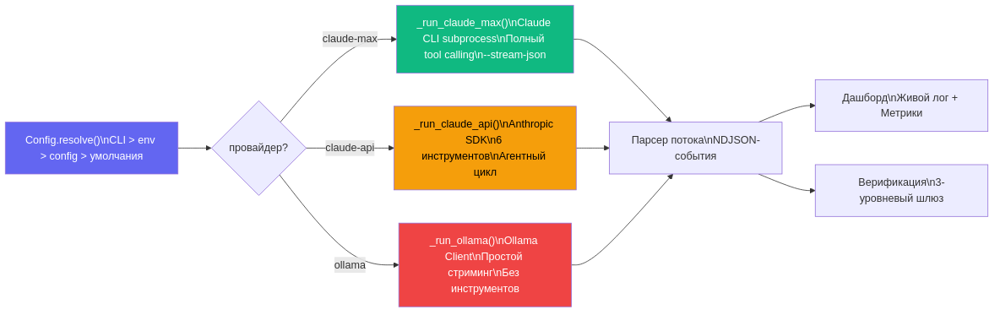
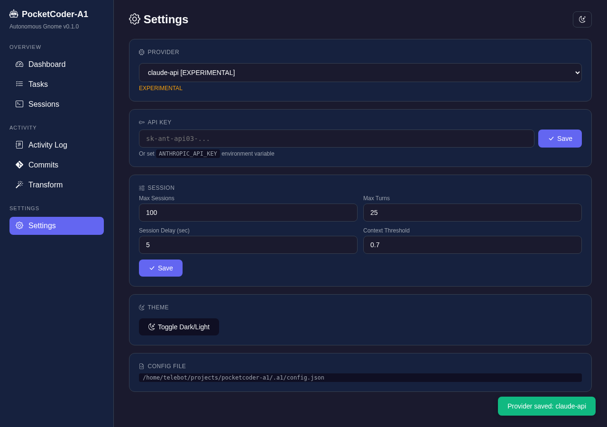
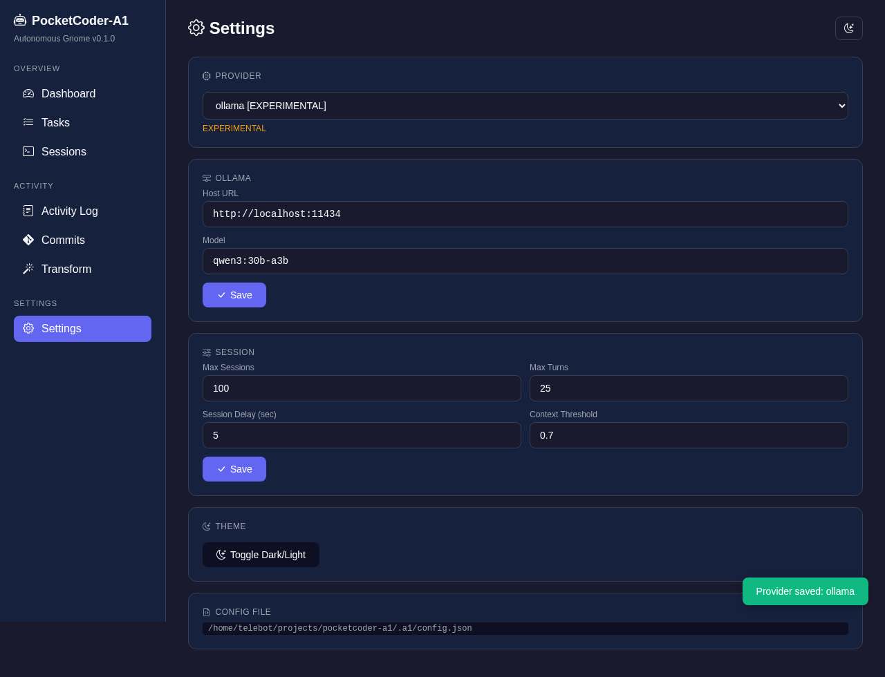
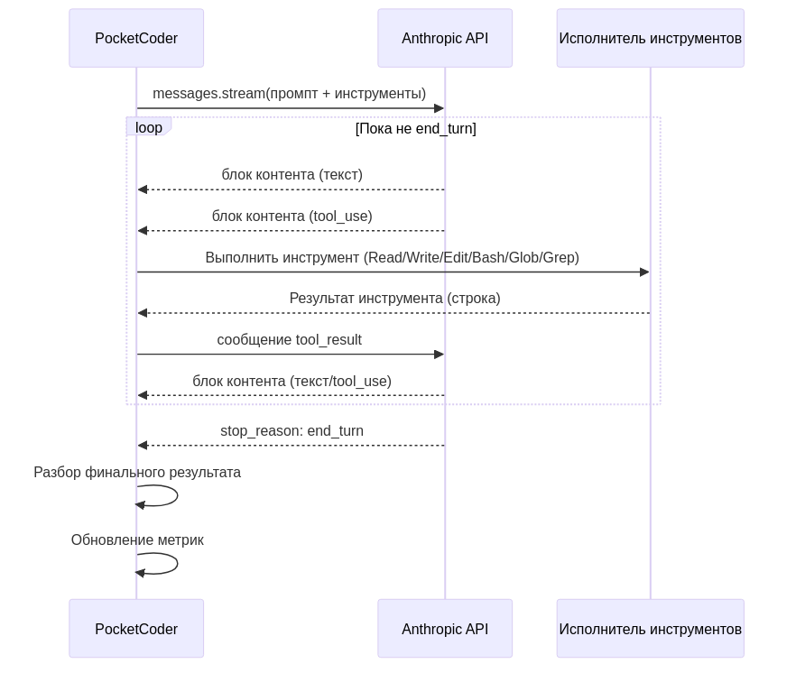

# Как мы добавили локальные модели в автономного агента и перестали бояться счетов за API

> Или почему провайдер-роутер - это первое, что нужно делать при интеграции нескольких LLM.

---

Счёт за Claude API пришёл на $120 за неделю. Мы просто тестировали нашего автономного агента - запускали, останавливали, дебажили парсер, снова запускали. Каждый тест - это промпт на 15-20 тысяч токенов, плюс ответ, плюс tool_use. За день набегало 40-50 сессий. Умножаем на 7 дней - получаем чек, после которого хочется запускать `ollama serve` и забыть про API навсегда.

Так появилась система провайдеров в PocketCoder-A1. Три варианта запуска одного и того же агента: Claude Max (бесплатно по подписке), Claude API (по ключу, $0.003-0.015 за тысячу токенов), и Ollama (бесплатно, локально, но без инструментов). В этой статье - как мы спроектировали роутер, что под капотом у каждого провайдера, и почему Ollama - это не замена Claude, а дополнение.

Если вы не читали первую статью о PocketCoder-A1 - рекомендую начать с неё. Там архитектура, верификация, 13 багов, дашборд. Эта статья - продолжение, фокус на провайдерах и конфигурации.

---

## Содержание

1. [Проблема: один провайдер - это зависимость](#1-проблема)
2. [Архитектура роутера](#2-архитектура-роутера)
3. [Система конфигурации](#3-система-конфигурации)
4. [Настройка Ollama](#4-настройка-ollama)
5. [Ollama под капотом](#5-ollama-под-капотом)
6. [Claude API под капотом](#6-claude-api-под-капотом)
7. [Сравнение провайдеров](#7-сравнение)
8. [Расширяемость: как добавить свой провайдер](#8-расширяемость)
9. [Что дальше](#9-что-дальше)

---

## 1. Проблема

PocketCoder-A1 изначально работал только через Claude CLI. Это удобно - подписка Max даёт безлимитный доступ, Claude Code установлен как npm-пакет, subprocess запускается одной строкой. Но у этого подхода есть три проблемы.

Первая - привязка к подписке. Не у каждого есть Max subscription за $100/месяц. Второй вариант - API ключ, но тогда нужен Anthropic SDK и собственный agentic loop. Третья проблема - иногда нужно тестировать без затрат вообще. Когда дебажишь парсер или верификацию, тебе не нужен умный ответ - тебе нужен любой ответ. Локальная модель на 8B параметров справится.

Мы решили сделать так: один и тот же agent loop, одна и та же верификация, один и тот же дашборд - но разные способы вызова модели. Провайдер отвечает только за одну вещь: получить промпт, вернуть ответ (и, если возможно, вызвать инструменты по дороге).

---

## 2. Архитектура роутера

Роутер реализован в методе `run_session()` класса `SessionLoop`. Это три строчки кода, но за ними стоит ключевое архитектурное решение - провайдер определяется при старте и не меняется в процессе работы:

```python
def run_session(self, prompt: str) -> int:
    """Run one session with the configured provider."""
    if self.provider == "claude-max":
        return self._run_claude_max(prompt)
    elif self.provider == "claude-api":
        return self._run_claude_api(prompt)
    elif self.provider.startswith("ollama"):
        return self._run_ollama(prompt)
    else:
        print(f"[ERROR] Unknown provider: {self.provider}")
        return 1
```

Каждый провайдер реализован как приватный метод `SessionLoop`: `_run_claude_max()` на 90 строк, `_run_claude_api()` на 170 строк, `_run_ollama()` на 95 строк. Все три метода следуют одному контракту: принимают промпт как строку, возвращают exit code (0 = успех), обновляют `_session_metrics`, пишут лог в `.a1/sessions/`, и вызывают `_log_callback` для дашборда.



Выбор провайдера происходит в `cli.py` через конфигурационную цепочку. Когда вы запускаете `pca start`, CLI загружает `Config`, вызывает `resolve()` для слияния всех источников настроек, и передаёт результат в конструктор `SessionLoop`:

```python
config = Config(project_dir)
resolved = config.resolve(cli_args={
    "provider": args.provider if args.provider != "claude-max" else None,
    "model": getattr(args, "model", None),
    "api_key": getattr(args, "api_key", None),
    "ollama_host": getattr(args, "ollama_host", None),
    "ollama_model": getattr(args, "ollama_model", None),
    "max_sessions": args.max_sessions if args.max_sessions != 100 else None,
    "max_turns": getattr(args, "max_turns", None),
    "session_delay": getattr(args, "session_delay", None),
})

loop = SessionLoop(project_dir=project_dir, **resolved)
```

Обратите внимание на `if args.provider != "claude-max" else None`. CLI-аргументы передаются в `resolve()` со значением `None` для неуказанных флагов. Это нужно, чтобы значение по умолчанию из argparse ("claude-max") не перезаписывало значение из конфигурационного файла. Если пользователь записал `provider: ollama` в config.json и запускает просто `pca start` - он ожидает Ollama, а не claude-max.

---

## 3. Система конфигурации

Конфигурация живёт в модуле `config.py` (126 строк) и хранится в файле `.a1/config.json` рядом с checkpoint и задачами. Класс `Config` реализует четырёхуровневую цепочку приоритетов:

```
CLI флаги  >  переменные окружения  >  config.json  >  значения по умолчанию
```

Значения по умолчанию задаются в словаре `DEFAULTS`:

```python
DEFAULTS = {
    "provider": "claude-max",
    "model": None,
    "api_key": None,
    "ollama_host": "http://localhost:11434",
    "ollama_model": "qwen3:30b-a3b",
    "max_sessions": 100,
    "max_turns": 25,
    "session_delay": 5,
    "context_threshold": 0.70,
}
```

Переменные окружения маппятся на ключи конфигурации через `ENV_MAP`:

```python
ENV_MAP = {
    "ANTHROPIC_API_KEY": "api_key",
    "OLLAMA_HOST": "ollama_host",
    "OLLAMA_MODEL": "ollama_model",
}
```

Метод `resolve()` - сердце конфигурации. Он собирает итоговый словарь из четырёх слоёв:

```python
def resolve(self, cli_args: Optional[dict] = None) -> dict:
    # 1. Start with defaults
    result = dict(DEFAULTS)

    # 2. Overlay config.json values
    for k, v in self._data.items():
        if v is not None:
            result[k] = v

    # 3. Overlay env vars
    for env_var, config_key in ENV_MAP.items():
        val = os.environ.get(env_var)
        if val:
            result[config_key] = val

    # 4. Overlay CLI args (skip None = "not provided")
    if cli_args:
        for k, v in cli_args.items():
            if v is not None:
                result[k] = v

    result.pop("context_threshold", None)
    return result
```

Каждый следующий слой перезаписывает предыдущий, но только если значение не `None`. Это ключевая деталь: `None` означает "не указано", а не "сбросить в пустое значение".

Управление конфигурацией из CLI:

```bash
pca config                     # показать все настройки
pca config provider            # показать конкретный ключ
pca config provider ollama     # установить значение
pca config api_key sk-ant-...  # API ключ (будет замаскирован при отображении)
pca config --reset             # сбросить к умолчаниям
```

Для API-ключей есть маскирование при выводе - `mask_api_key()` показывает первые 10 символов и последние 4: `sk-ant-api0...3x7f`. Ключ хранится в `.a1/config.json` как есть, но при отображении через `pca config` или на странице Settings дашборда всегда маскируется.



---

## 4. Настройка Ollama

Ollama - это сервер для запуска локальных моделей. Установка зависит от платформы, но суть одна: скачать, запустить, загрузить модель.

```bash
# Установка (Linux)
curl -fsSL https://ollama.com/install.sh | sh

# Запуск сервера
ollama serve

# Загрузка модели (в отдельном терминале)
ollama pull qwen3:30b-a3b
```

Мы используем `qwen3:30b-a3b` по умолчанию - это неплохой баланс между качеством и скоростью для задач, связанных с кодом. Но можно использовать любую модель, которую поддерживает Ollama: `llama3.1:8b`, `codellama:34b`, `deepseek-coder-v2` - что угодно.

Настройка PocketCoder для Ollama:

```bash
pca config provider ollama
pca config ollama_model qwen3:30b-a3b
pca config ollama_host http://localhost:11434
```

Или одной командой при запуске:

```bash
pca start --provider ollama --ollama-model llama3.1:8b
```

Или через переменные окружения:

```bash
export OLLAMA_HOST=http://192.168.1.100:11434
export OLLAMA_MODEL=qwen3:30b-a3b
pca start --provider ollama
```

Все три способа работают, приоритет - CLI > env > config.json > defaults.



---

## 5. Ollama под капотом

Метод `_run_ollama()` - самый простой из трёх провайдеров, и это осознанный выбор. Ollama-модели (пока) не поддерживают tool calling в формате, который нужен для agentic loop. Поэтому Ollama-провайдер работает как чистый text-in/text-out: отправляем промпт, стримим ответ, сохраняем.

```python
def _run_ollama(self, prompt: str) -> int:
    """Run session via Ollama [EXPERIMENTAL].

    Simple streaming - no tool calling. The model generates text
    with instructions, but does NOT execute them automatically.
    """
    try:
        import ollama as _ollama
    except ImportError:
        print("[ERROR] ollama SDK not installed. Run: pip install ollama")
        return 1

    model = self.model or self.ollama_model
    client = _ollama.Client(host=self.ollama_host)

    full_response = []
    with open(log_file, "w") as f:
        stream = client.chat(
            model=model,
            messages=[{"role": "user", "content": prompt}],
            options={"num_ctx": 32768},
            stream=True,
        )

        for chunk in stream:
            if not self._running:
                break

            message = chunk.get("message", {})
            content = message.get("content", "")
            if content:
                full_response.append(content)
                print(content, end="", flush=True)
                f.write(content)

            # Update metrics from Ollama response
            if chunk.get("done"):
                self._session_metrics["tokens_in"] = chunk.get("prompt_eval_count", 0)
                self._session_metrics["tokens_out"] = chunk.get("eval_count", 0)
```

Несколько технических деталей, которые стоит объяснить.

`options={"num_ctx": 32768}` - размер контекстного окна. Ollama по умолчанию использует 2048 токенов, чего явно мало для наших промптов (checkpoint + задачи + инструкции). 32K - разумный компромисс между памятью и размером контекста.

`stream=True` - стриминг по чанкам. Без стриминга пришлось бы ждать полного ответа, а модель на 30B параметров может думать минуту. Со стримингом текст появляется посимвольно, и `_log_callback` отправляет его в дашборд.

Метрики приходят только в финальном чанке (когда `chunk.get("done")` возвращает `True`). Ollama отдаёт `prompt_eval_count` (токены на промпт) и `eval_count` (токены на генерацию). Мы маппим их на `tokens_in` и `tokens_out` - те же поля, что и у Claude. Дашборд не знает и не должен знать, какой провайдер используется - карточки Tokens и Cost работают одинаково.

Главное ограничение - нет tool calling. Модель получает промпт с инструкциями "прочитай файл X, напиши в файл Y", но не может это сделать. Она генерирует текст с описанием того, что нужно сделать. Для тестирования парсера и дашборда этого достаточно. Для реальной автономной работы - нет.

---

## 6. Claude API под капотом

Claude API - это полноценный agentic loop. Модель получает 6 инструментов (Read, Write, Edit, Bash, Glob, Grep), может их вызывать, получать результаты, и продолжать работу.



Вот схема:

```
Prompt -> API call -> Response with tool_use ->
  -> Execute tools -> Send results -> API call ->
    -> Response with tool_use -> ... (до max_turns или end_turn)
```

Инструменты определяются в `_define_api_tools()`. Каждый - это JSON Schema для Anthropic API:

```python
def _define_api_tools(self) -> list:
    """Define tools for Anthropic API tool_use (6 tools)."""
    return [
        {
            "name": "Read",
            "description": "Read a file from disk. Returns file contents.",
            "input_schema": {
                "type": "object",
                "properties": {
                    "file_path": {"type": "string", "description": "Absolute path to file"},
                },
                "required": ["file_path"],
            },
        },
        {
            "name": "Write",
            "description": "Write content to a file (creates or overwrites).",
            "input_schema": { ... },
        },
        # + Edit, Bash, Glob, Grep
    ]
```

Исполнение инструментов происходит в `_execute_tool()`. Каждый инструмент - это обычный Python: `Path.read_text()` для Read, `Path.write_text()` для Write, `subprocess.run()` для Bash. Ничего магического, но есть защиты: таймаут 120 секунд на Bash-команды, ограничение вывода 10000 символов на Grep, проверка уникальности строки в Edit.

Главный цикл `_run_claude_api()` работает так:

```python
client = anthropic.Anthropic(api_key=api_key)
tools = self._define_api_tools()
messages = [{"role": "user", "content": prompt}]

for turn in range(self.max_turns):
    if not self._running:
        break

    # API call with streaming
    with client.messages.stream(
        model=model,
        max_tokens=8192,
        system=system_prompt,
        tools=tools,
        messages=messages,
    ) as stream:
        response = stream.get_final_message()

    # If no tool_use - model is done
    if response.stop_reason == "end_turn" or not tool_use_blocks:
        break

    # Execute tools and build tool_result messages
    messages.append({"role": "assistant", "content": assistant_content})

    tool_results = []
    for block in tool_use_blocks:
        result_text = self._execute_tool(block.name, block.input)
        tool_results.append({
            "type": "tool_result",
            "tool_use_id": block.id,
            "content": result_text[:15000],
        })
    messages.append({"role": "user", "content": tool_results})
```

Модель по умолчанию - `claude-sonnet-4-20250514`. Можно переключить через `--model claude-opus-4-20250514` если нужна максимальная точность (но и максимальная стоимость).

Мониторинг контекста работает и здесь: `response.usage.input_tokens` делим на `CONTEXT_WINDOW_SIZE` (200K), и если процент превышает `CONTEXT_THRESHOLD` (70%) - сохраняем checkpoint и завершаем сессию. Agent loop подхватит работу в следующей сессии.

Важная деталь: ошибки аутентификации и rate limiting обрабатываются отдельно. `anthropic.AuthenticationError` - ключ невалиден. `anthropic.RateLimitError` - превышен лимит запросов. Оба случая возвращают exit code 1, и agent loop может повторить попытку в следующей сессии.

---

## 7. Сравнение провайдеров

| Характеристика | Claude Max | Claude API | Ollama |
|----------------|-----------|------------|--------|
| Стоимость | $100/мес (подписка) | $0.003-0.015/1K токенов | Бесплатно |
| Tool calling | Полный (CLI tools) | 6 инструментов | Нет |
| Модель | Claude Sonnet/Opus | claude-sonnet-4, claude-opus-4 | Любая (qwen3, llama, deepseek) |
| Стриминг | NDJSON (stream-json) | Anthropic SDK streaming | Ollama SDK streaming |
| Автономная работа | Полная | Полная | Только текст |
| Контекст | 200K | 200K | 32K-128K (зависит от модели) |
| Требования | npm, Claude CLI, подписка | pip install anthropic, API ключ | ollama serve, pip install ollama |
| Статус | Стабильный | EXPERIMENTAL | EXPERIMENTAL |


Claude Max - основной провайдер. Он запускает Claude CLI как subprocess, и весь tool calling происходит на стороне CLI. Наш код только парсит NDJSON-поток и обновляет метрики. Это самый мощный вариант - Claude CLI имеет доступ к полному набору инструментов, включая MCP.

Claude API - для тех, у кого есть API-ключ, но нет подписки Max. Мы сами реализуем agentic loop с 6 инструментами. Функционально близок к Claude Max, но инструментов меньше (нет MCP, нет NotebookEdit), и есть прямой контроль над расходами.

Ollama - для разработки и тестирования. Запускаешь локальную модель, не тратишь ни копейки. Модель не может выполнять инструменты, но генерирует текст - этого достаточно для тестирования дашборда, парсера, верификации.

---

## 8. Расширяемость

Добавить новый провайдер - это три шага.

Шаг первый: добавить метод `_run_yourprovider()` в `SessionLoop`. Контракт простой - принять промпт, вернуть exit code, обновить `_session_metrics`, писать в лог-файл, вызывать `_log_callback`.

Шаг второй: добавить ветку в `run_session()`:

```python
elif self.provider == "yourprovider":
    return self._run_yourprovider(prompt)
```

Шаг третий: добавить `"yourprovider"` в `choices` в `cli.py`:

```python
p_start.add_argument(
    "--provider",
    choices=["claude-max", "claude-api", "ollama", "yourprovider"],
)
```

И, если нужно, добавить дефолтные значения в `DEFAULTS` и переменные окружения в `ENV_MAP` в `config.py`.

Например, для OpenAI-совместимого API (vLLM, LM Studio, Together AI) достаточно написать метод на 50-60 строк, который делает HTTP-запрос к `/v1/chat/completions` со стримингом. Если API поддерживает function calling - можно реиспользовать `_define_api_tools()` и `_execute_tool()`, адаптировав формат вызова.

---

## 9. Что дальше

Провайдеры помечены как EXPERIMENTAL не просто так. Claude API и Ollama работают, но не прошли полный E2E-цикл на реальных проектах - мы тестировали их в изоляции (запуск, получение ответа, метрики), но не на полном цикле "3 задачи от начала до конца".

В ближайших планах: OpenAI-совместимый провайдер (это откроет доступ к десяткам API - vLLM, Together, Groq, LM Studio), tool calling для Ollama (модели уже начинают его поддерживать, но формат отличается от Anthropic), и fallback-логика (если один провайдер недоступен - переключиться на другой).

Первая статья о PocketCoder-A1 - архитектура, верификация, дашборд, 13 багов - [здесь](../01_pocketcoder/article_ru.md).

---

**GitHub**: [github.com/Chashchin-Dmitry/pocketcoder-a1](https://github.com/Chashchin-Dmitry/pocketcoder-a1)

**Быстрый старт с Ollama**:
```bash
pip install -e .
ollama pull qwen3:30b-a3b
pca init my-project
pca start --provider ollama
```

Если дочитали до конца - спасибо. Вопросы и фидбэк - в Issues на GitHub.
