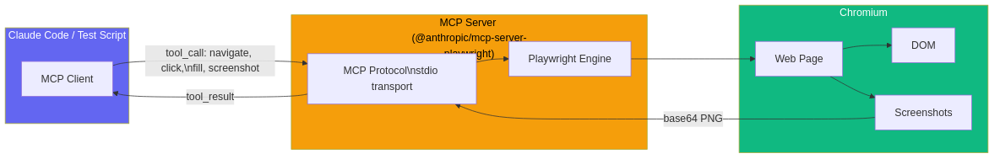
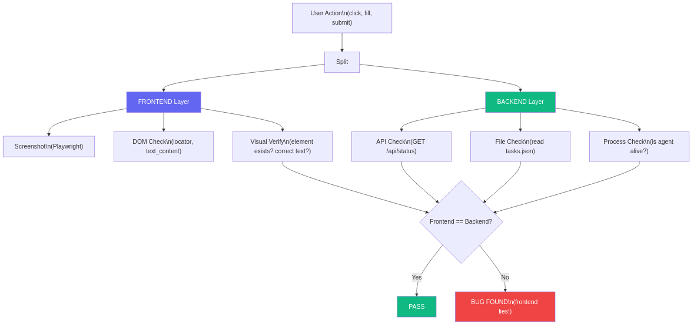
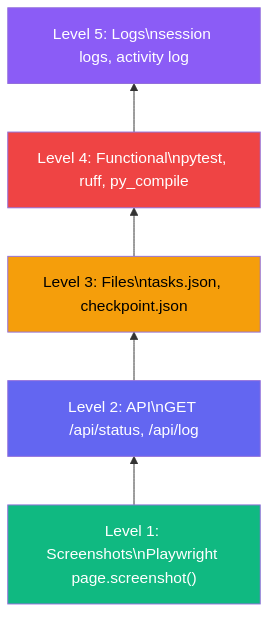

# Your Frontend Is Lying: How We Test Web Apps with MCP + Synchronized Verification

> The green badge on the dashboard showed "3/3 done". But tasks.json said "2 done". We trusted the dashboard for a week.

---

Picture this. You click "Start Agent" in the web interface. The agent runs, cards update, the status turns green, the progress bar fills up. Everything looks perfect. You close the browser and go grab coffee.

Then you open `.a1/tasks.json` and see that one of three tasks is still `"status": "pending"`. The frontend was showing 3/3, but the backend knew it was 2/3. Cache? Race condition? Bug in AJAX polling? Doesn't matter. What matters is this - we were looking at the screen and believing what we saw.

This story taught us a simple principle that's now baked into every test we write: **don't trust the frontend, verify the backend**. In this article, I'll walk through how we build E2E tests for PocketCoder-A1 - an autonomous coding agent with a web dashboard - using MCP Playwright, parallel monitoring, and five-level verification.

---

## Table of Contents

1. [The principle: your frontend lies](#1-the-principle)
2. [What is MCP and why we need it](#2-what-is-mcp)
3. [Tools](#3-tools)
4. [Step-by-step testing methodology](#4-methodology)
5. [Event chains - what happens when a user adds a task](#5-event-chains)
6. [Real bugs we found with this approach](#6-bugs)
7. [Results: 6 E2E tests](#7-results)
8. [Conclusions and what's next](#8-conclusions)

---

## 1. The principle

It sounds harsh, but let's look at the facts. Here's a real table of discrepancies we caught while testing PocketCoder:

| Frontend shows | Backend says | Cause |
|---------------|-------------|-------|
| Tasks: 3/3 done | tasks.json: 2 done, 1 pending | AJAX read cached data before file update |
| Tokens: 12.4K | rate_limit_event: 0 | Card showed a value from the previous session |
| Status: Running | checkpoint.json: IDLE | Agent crashed, UI didn't update |
| Cost: $0.08 | Actually: $0.12 | JS estimateCost() didn't account for cache_creation |

We found every single one of these bugs only because we were checking both layers simultaneously - the visual layer (screenshots via Playwright) and the data layer (API + files on disk). If we'd only looked at screenshots, everything would've appeared green. If we'd only checked the API, we'd have missed visual bugs like broken layouts on mobile.

Hence the rule: every check in our E2E test must work on two levels. A screenshot is an eyewitness account. JSON from the API or a file is the black box recording. When they agree - we believe. When they disagree - we dig.

---

## 2. What is MCP

Model Context Protocol is a standard from Anthropic for connecting tools to AI models. Instead of every AI agent writing its own Playwright integration, you set up an MCP server once, and any agent gets browser access through a unified protocol.

Our `.mcp.json` in the project root looks like this:

```json
{
  "mcpServers": {
    "playwright": {
      "type": "stdio",
      "command": "npx",
      "args": ["playwright@latest"]
    }
  }
}
```

Four lines of config - and Claude (or any other MCP-compatible agent) gets full access to Chromium: it can open pages, click elements, fill forms, take screenshots, execute JavaScript. Not through an HTTP API, but through a real browser.



How does MCP Playwright differ from regular Playwright? Regular Playwright is a Python/JS library you call from your code. MCP Playwright is a server that runs as a separate process and accepts commands via a standardized protocol. The AI agent sends a request like "open page X", the MCP server passes it to Playwright, gets the result, sends it back. The agent doesn't even know there's Chromium under the hood - it just uses a tool.

For our E2E tests, we use both approaches. MCP Playwright is for the Vision QA tester (`a1/tester/`), which runs inside the AI agent. Plain Playwright Python API is for standalone tests (`sandbox/e2e_dashboard_ux/`), which run without AI. This article covers both, because the methodology is the same.

---

## 3. Tools

Our E2E testing stack is built from four components, each responsible for its own verification layer.

**Playwright** - a real Chromium browser in headless mode. Opens pages, clicks buttons, fills forms, takes screenshots. This is our "eye" - the only way to see what the user sees.

**requests** - an HTTP client for direct API calls. We hit `/api/status` and `/api/log` directly, bypassing the frontend. This is our "black box" - data the backend delivers without intermediaries.

**json + pathlib** - direct file reads from disk. `.a1/tasks.json`, `.a1/checkpoint.json` - we open them directly and cross-reference with what the API and frontend show. This is the most reliable layer - a file can't lie.

**subprocess** - system command execution: `py_compile` for syntax checks, `pytest` for tests, `ruff` for linting. This is our "validator" - an independent check that the code actually works.

Here's the basic scaffolding of our test:

```python
import json
import requests
from pathlib import Path
from playwright.sync_api import sync_playwright

PORT = 7331
BASE = f"http://localhost:{PORT}"
PROJECT_DIR = Path("/home/telebot/projects/pocketcoder-a1")

ss_count = 0
checks_passed = 0
checks_failed = 0

def ss(page, name):
    """Numbered screenshot"""
    global ss_count
    ss_count += 1
    path = SS_DIR / f"{ss_count:02d}_{name}.png"
    page.screenshot(path=str(path), full_page=True)
    print(f"  [SS #{ss_count:02d}] {name}")

def check(condition, msg):
    """Assert with counter"""
    global checks_passed, checks_failed
    if condition:
        checks_passed += 1
        print(f"  [OK] {msg}")
    else:
        checks_failed += 1
        print(f"  [FAIL] {msg}")

def api(endpoint):
    """Direct GET to API"""
    return requests.get(f"{BASE}{endpoint}").json()
```

Three functions - `ss()`, `check()`, `api()` - that's the entire framework. Screenshot, assertion, backend query. Everything else builds on top.


---

## 4. Step-by-step testing methodology

### Step 0: Setup - verify the server is alive

Before testing anything, we need to confirm the dashboard is running. We don't start it from the test - it should already be up (`pca ui --no-browser`). The test just checks availability:

```python
try:
    resp = requests.get(f"{BASE}/api/status", timeout=5)
    status = resp.json()
    check(resp.status_code == 200, f"Dashboard responds on :{PORT}")
    check("checkpoint" in status, "API returns checkpoint")
    check("tasks" in status, "API returns tasks")
    check("metrics" in status, "API returns metrics")
except Exception as e:
    print(f"  [FATAL] Dashboard not running: {e}")
    sys.exit(1)
```

Notice that we don't just check "status 200" - we verify the response structure. Does it have `checkpoint`? Does it have `tasks`? Does it have `metrics`? If the API returns 200 but without the required fields - that's still a bug.

### Step 1: Baseline - screenshot the initial state

Before any actions, we photograph every page. This is our baseline - the "before" state.

```python
with sync_playwright() as p:
    browser = p.chromium.launch(headless=True)
    page = browser.new_page(viewport={"width": 1400, "height": 900})

    page.goto(BASE)
    page.wait_for_load_state("networkidle")
    ss(page, "dashboard_initial")

    cards = page.locator(".card").count()
    check(cards == 6, f"Dashboard has 6 cards (got {cards})")
```

Why `wait_for_load_state("networkidle")`? Because our dashboard loads data via AJAX. If you take the screenshot before the requests finish, you'll get empty cards. `networkidle` waits until the network goes quiet.

### Step 2: User actions - fill forms via Playwright

This is where it gets interesting. We don't just hit the API - we fill forms like a real user.

```python
for i, task in enumerate(TASKS_TO_CREATE):
    page.goto(f"{BASE}/tasks")
    page.wait_for_load_state("networkidle")

    page.locator('input[name="task"]').fill(task["title"])
    page.locator('textarea[name="description"]').fill(task["description"])

    if i == 0:
        ss(page, "form_first_task")

    page.locator('button:has-text("Add Task")').click()
    page.wait_for_load_state("networkidle")
```

We deliberately go through the web form, not a direct POST request. Because we care about the full path: HTML form -> HTTP POST -> TaskManager.add_task() -> tasks.json. If we POST-ed directly, we'd miss bugs in the HTML (wrong name attribute, broken submit, XSS).

After filling, we do a dual-layer verification. First layer - the file on disk:

```python
tasks_data = json.loads(
    (PROJECT_DIR / ".a1" / "tasks.json").read_text()
)
task_titles = [t["title"] for t in tasks_data["tasks"]]
check(
    "E2E Test Task - Dashboard UX" in task_titles,
    "Task saved to .a1/tasks.json"
)
```

Second layer - the API:

```python
api_status = api("/api/status")
api_tasks = [t["title"] for t in api_status["tasks"]]
check(
    "E2E Test Task - Dashboard UX" in api_tasks,
    "Task visible via API"
)
```

If the file says "present" but the API says "absent" - it's a server caching problem. If the API says "present" but the file says "absent" - it's a write problem. The dual-layer check catches both cases.

### Step 3: Parallel monitoring - polling every 15 seconds

This is the most powerful part of our methodology. When the agent is working (after POST `/start`), we launch a polling loop: every 15 seconds we take a screenshot, query the API, read the file.

```python
POLL_INTERVAL = 15
MAX_CYCLES = 20  # 20 * 15s = 5 min max

for cycle in range(MAX_CYCLES):
    time.sleep(POLL_INTERVAL)
    elapsed = (cycle + 1) * POLL_INTERVAL

    # === FRONTEND: screenshot ===
    page.goto(BASE)
    page.wait_for_load_state("networkidle")
    if cycle % 2 == 0:
        ss(page, f"monitor_{elapsed}s")

    tokens_val = page.locator("#tokens-count").text_content()
    cost_val = page.locator("#cost-value").text_content()
    task_val = page.locator("#task-count").text_content()

    # === BACKEND: API ===
    status = api("/api/status")
    metrics = status.get("metrics", {})
    tokens_in = metrics.get("tokens_in", 0)

    # === BACKEND: File ===
    tasks_data = json.loads(
        (PROJECT_DIR / ".a1" / "tasks.json").read_text()
    )
    done_count = sum(1 for t in tasks_data["tasks"] if t["status"] == "done")

    # === SYNC CHECK ===
    print(f"  [{elapsed:3d}s] running={status['running']}")
    print(f"    FRONT: tasks={task_val} tokens={tokens_val}")
    print(f"    BACK:  tasks={done_count}/{len(tasks_data['tasks'])} "
          f"tokens={tokens_in:,}")
```

Look at what we're doing: on every cycle - three data sources. Frontend (what the user sees), API (what the server returns), file (what's actually on disk). And we print all three side by side. If `FRONT: tasks=3/3` but `BACK: tasks=2/3` - bug found, cycle number is known, screenshot exists.



### Step 4: Five-level verification

When the agent finishes, we run the final check. Not "API returned 200", but five real levels:



```
Level 1: Screenshots    - final state screenshots of all pages
Level 2: API            - GET /api/status, check all fields
Level 3: Files          - tasks.json, checkpoint.json, created files
Level 4: Front/Back     - sync check: API.done == File.done
Level 5: Metrics        - tokens > 0, tools > 0, duration > 0, logs > 0
```

Here's what Level 4 looks like - the synchronization check:

```python
# Level 4: Front/Back sync
api_done = sum(1 for t in status["tasks"] if t["status"] == "done")
file_done = sum(1 for t in tasks_final["tasks"] if t["status"] == "done")
check(
    api_done == file_done,
    f"Sync: API({api_done}) == File({file_done})"
)
```

If the API shows 3 done but the file shows 2, the sync check fails. This simple assertion saved us from three caching-related bugs.

---

## 5. Event chains

Here's what actually happens when a user adds a task through the form. This isn't an abstraction - it's the concrete call chain that we verify at every link:

```
User fills form
  └── input[name="task"].fill("Add health endpoint")
  └── textarea[name="description"].fill("Create /api/health...")
  └── button "Add Task".click()
      └── POST /add-task
          └── DashboardHandler.do_POST()
              └── TaskManager(PROJECT_DIR).add_task(title, desc)
                  └── tasks.json: tasks[].append({id, title, status: "pending"})
              └── log_activity("Task added", title, "success")
                  └── ACTIVITY_LOG.append(...)
          └── redirect("/")
              └── GET / → dashboard page
                  └── JavaScript: fetch("/api/status")
                      └── DashboardHandler.send_json_status()
                          └── TaskManager.get_tasks() → read tasks.json
                          └── TaskManager.get_progress() → [0, N]
                          └── Response JSON → cards update
```

Our test verifies four points in this chain: the form (Playwright fill + click), the file (tasks.json read), the API (/api/status GET), and the visual (screenshot after redirect). If any link breaks - we know exactly where.

And here's the chain for monitoring a running agent - what our 15-second loop checks:

```
Agent session running
  └── Claude subprocess: stdout → NDJSON stream
      └── loop.py: _parse_stream_event()
          ├── type: "assistant" + tool_use "Read"
          │   └── _log_callback("read", filename)
          │       └── AGENT_LOG_BUFFER.append({type: "read", line: ...})
          ├── type: "rate_limit_event"
          │   └── _session_metrics["tokens_in"] += input_tokens
          │   └── _session_metrics["tokens_out"] += output_tokens
          └── type: "result"
              └── _verify_session()
                  └── checkpoint.json: status → "COMPLETED"

  Our monitor checks:
  ├── FRONT: page.locator("#tokens-count").text_content()
  ├── API:   GET /api/status → metrics.tokens_in
  ├── API:   GET /api/log?since=N → new entries
  └── FILE:  tasks.json → done count
```

---

## 6. Bugs we found

Synchronized two-layer testing isn't an academic exercise. Here are real bugs we caught specifically because of this approach.

**Bug #13: `$` in JavaScript inside Python Template**. The dashboard is generated via `string.Template`, and the JavaScript had strings like `'$0.00'` and `'$' + value`. Python Template interpreted `$0` as a placeholder and crashed. We found this only through the E2E test - running the file directly worked fine, the bug only showed up through the HTTP server. Fix: escape with `$$`.

**Bug #12: case-sensitive criteria**. The validator was checking `success_criteria.lower()` to find patterns like "file exists", but then used the lowercased filename to check on disk. On Linux, `README.md` and `readme.md` are different files. We found this in E2E test #4, when the agent created `docs/API.md` but the validator was looking for `docs/api.md`. Fix: `re.search()` on the original string.

**XSS in task creation**. Through Playwright, we submitted a task with `<script>alert(1)</script>` in the title. The dashboard rendered it without escaping. The E2E test caught this because we were comparing the page content with what was in tasks.json - the file had the raw HTML, but the page showed a blank (the script "executed" and disappeared from the DOM).

---

## 7. Results


Over the course of building PocketCoder-A1, we ran 6 full E2E tests. Each test isn't a single assertion - it's dozens of checks across both layers.

| # | Test | Tasks | Checks | Screenshots | Time |
|---|------|-------|--------|-------------|------|
| 1 | Basic cycle | 3/3 | 10 | 10 | 90s |
| 2 | Real project (epotos) | 3/3 | 36 | 36 | 150s |
| 3 | Stream-JSON verification | 1/1 | 23 | 21 | 60s |
| 4 | Verification system | 4/4 | 23 | 23 | 48s |
| 5 | Dashboard UX | - | 77/77 | 16 | ~30s |
| 6 | Full Cycle (web -> agent -> done) | 3/3 | 22/22 | 14 | 165s |

Test #5 is the most representative of our methodology. 77 checks in a single run: 6 cards, 8 colored icon types, 7 pages, JS functions (fmtTokens, fmtDuration, estimateCost, tickTimer), theme toggling, responsive layout at mobile viewport, and all API endpoints. Every check works on two layers.

Test #6 is the full cycle. We create 3 tasks through the web form, start the agent via POST /start, monitor every 15 seconds (frontend + backend), wait for completion, and verify across 5 levels. This test found the progress caching bug.

Our Vision QA tester (`a1/tester/`) runs 7 scenarios in a real Chromium instance: dashboard loading, adding a task, adding a thought, navigating all pages, theme toggle, Start/Stop button checks, and API test. Each scenario is a sequence of actions with screenshots at every step:

```python
class VisionTester:
    def run_all(self) -> TestReport:
        self.browser.launch()
        self._test_1_dashboard_loads()
        self._test_2_add_task()
        self._test_3_add_thought()
        self._test_4_navigate_all_pages()
        self._test_5_theme_toggle()
        self._test_6_start_stop_agent()
        self._test_7_api_endpoint()
        self.browser.close()
```


The key piece is the `Browser` class. It's a thin wrapper around Playwright that adds one thing: every action can be "photographed". Navigation, click, form fill - after each step we take a screenshot. This creates a visual history of the test that you can review with your own eyes or send to AI for analysis (via Claude Vision API).

---

## 8. Conclusions

Three principles we took away from this experience.

First - never test only the frontend. A green screen is not proof. A screenshot is evidence, but without backend confirmation it's worth nothing. Every `ss(page, name)` in our test is paired with `api("/api/status")` or `json.loads(file.read_text())`.

Second - parallel monitoring catches bugs that snapshot tests miss. Synchronization bugs appear under load, during race conditions, when the agent writes a file at the exact moment the API reads it. A 15-second loop with three data sources is the minimum net that catches these problems.

Third - MCP simplifies AI integration into testing. Our Vision QA tester uses MCP Playwright to give the AI agent browser access. The agent decides what to click, analyzes screenshots itself, writes its own report. Four lines in `.mcp.json` - and AI can see your frontend.

This methodology works for any web application with an API. You don't need an autonomous agent - even a simple SPA + REST API can be tested using the same principle: Playwright for the frontend, requests for the backend, files for ground truth. Three layers that keep each other honest.

---

*This is the third article in the PocketCoder-A1 series. The first - "[Building an Autonomous Coding Agent That Doesn't Trust Itself](../01_pocketcoder/article_en.md)" - covers architecture, 13 bugs, and a Live Demo. Project code: [github.com/pocketcoder-a1](https://github.com/pocketcoder-a1)*
