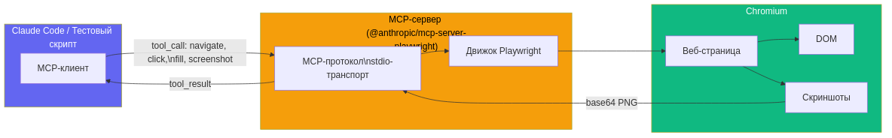
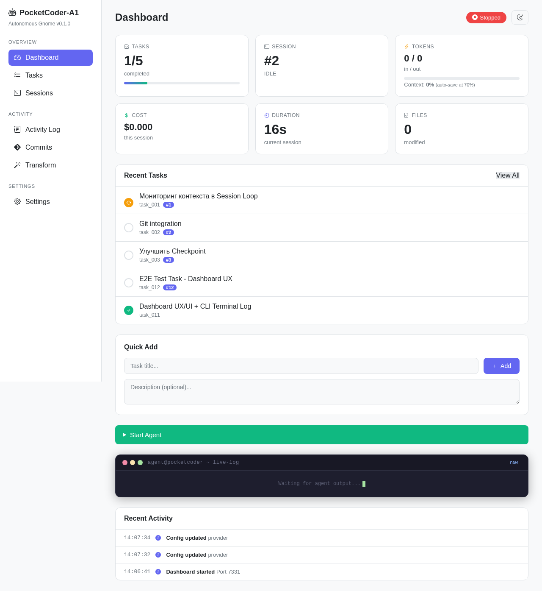
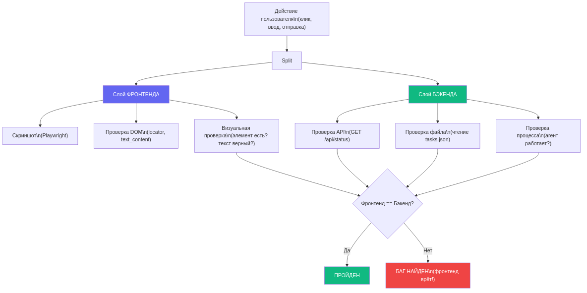
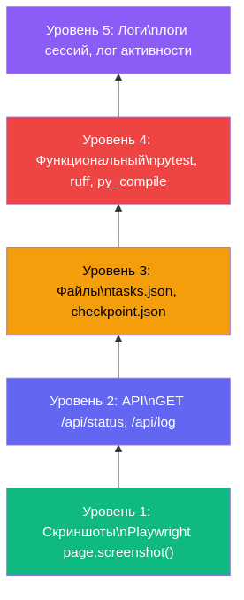
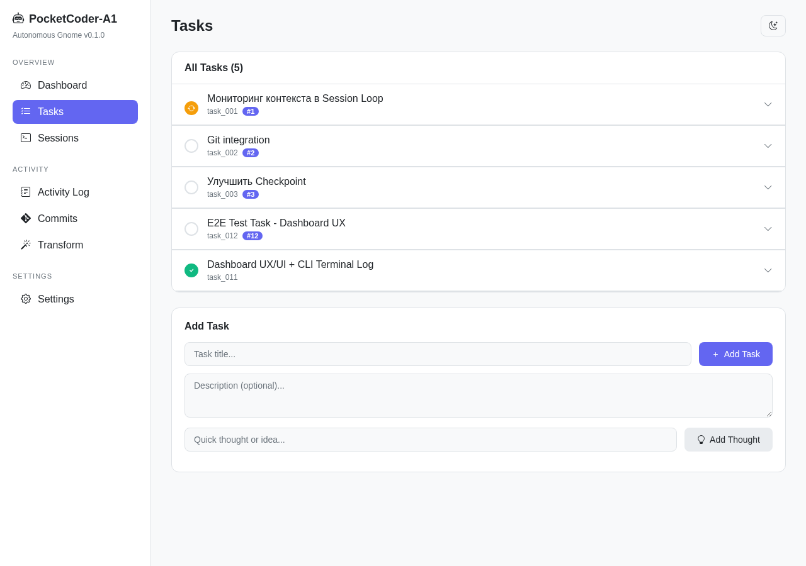
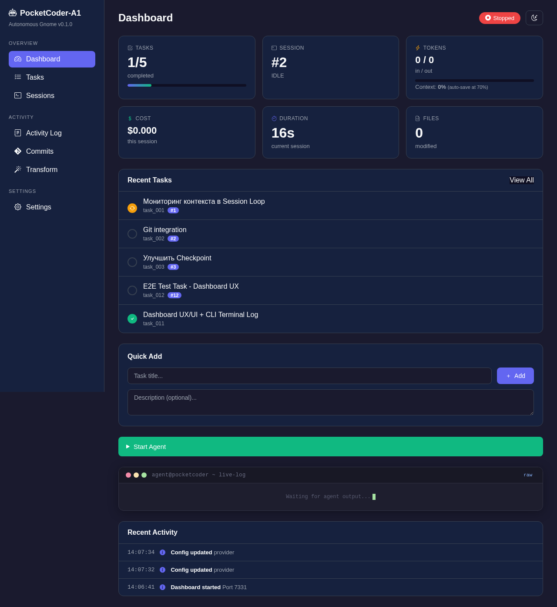
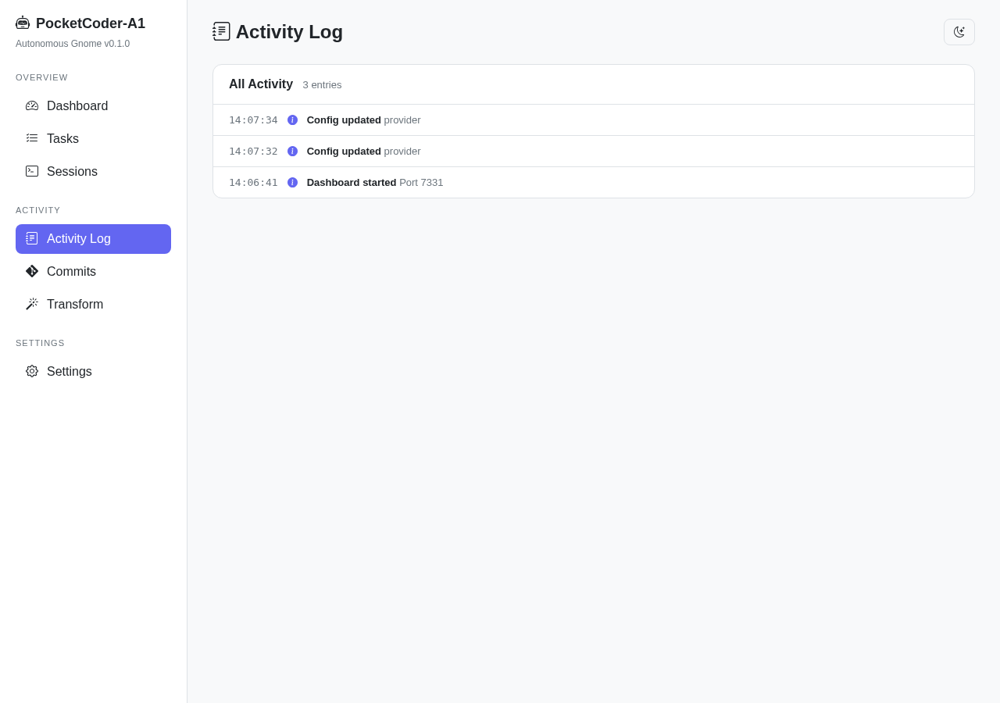

# Фронтенд врёт: как мы тестируем веб-приложения через MCP + синхронную верификацию

> Зелёный бейдж на дашборде показывал "3/3 done". А в tasks.json было "2 done". Мы верили дашборду неделю.

---

Представьте ситуацию. Вы нажали "Start Agent" в веб-интерфейсе. Агент отработал, карточки обновились, статус стал зелёным, прогресс-бар дошёл до конца. Всё выглядит идеально. Вы закрываете браузер и идёте пить кофе.

А потом открываете `.a1/tasks.json` и видите, что одна из трёх задач всё ещё `"status": "pending"`. Фронтенд показывал 3/3, а бэкенд знал про 2/3. Кэш? Гонка данных? Баг в AJAX-обновлении? Неважно. Важно одно - мы смотрели на экран и верили тому, что видим.

Эта история научила нас простому принципу, который теперь зашит в каждый наш тест: **не верь фронтенду, проверяй бэкенд**. В этой статье я расскажу, как мы строим E2E-тесты для PocketCoder-A1 - автономного coding-агента с веб-дашбордом - используя MCP Playwright, параллельный мониторинг и пятиуровневую верификацию.

---

## Содержание

1. [Принцип: фронтенд врёт](#1-принцип-фронтенд-врёт)
2. [Что такое MCP и зачем он нам](#2-что-такое-mcp)
3. [Инструменты](#3-инструменты)
4. [Методология тестирования по шагам](#4-методология)
5. [Event chains - что происходит при добавлении задачи](#5-event-chains)
6. [Баги, которые мы нашли этой методологией](#6-баги)
7. [Результаты: 6 E2E тестов](#7-результаты)
8. [Выводы и что дальше](#8-выводы)

---

## 1. Принцип: фронтенд врёт

Звучит грубо, но давайте посмотрим на факты. Вот реальная таблица расхождений, которые мы ловили в процессе тестирования PocketCoder:

| Фронтенд показывает | Бэкенд говорит | Причина |
|---------------------|----------------|---------|
| Tasks: 3/3 done | tasks.json: 2 done, 1 pending | AJAX прочитал кэш до обновления файла |
| Tokens: 12.4K | rate_limit_event: 0 | Карточка показала значение из прошлой сессии |
| Status: Running | checkpoint.json: IDLE | Агент упал, UI не обновился |
| Cost: $0.08 | Реально: $0.12 | JS estimateCost() не учитывал cache_creation |

Каждый из этих багов мы нашли только потому, что проверяли одновременно оба слоя - визуальный (скриншоты через Playwright) и данные (API + файлы на диске). Если бы мы смотрели только скриншоты - всё выглядело бы зелёным. Если бы только API - не поймали бы визуальные баги вроде сломанной вёрстки на мобильных.

Отсюда правило: каждый чек в нашем E2E-тесте обязан работать на двух уровнях. Скриншот - это свидетельство очевидца. JSON из API или файла - это показания чёрного ящика. Когда они совпадают - мы верим. Когда расходятся - копаем.

---

## 2. Что такое MCP

Model Context Protocol - это стандарт от Anthropic для подключения инструментов к AI-моделям. Вместо того чтобы каждый AI-агент писал свою интеграцию с Playwright, вы ставите MCP-сервер один раз, и любой агент получает доступ к браузеру через единый протокол.

Наш `.mcp.json` в корне проекта выглядит так:

```json
{
  "mcpServers": {
    "playwright": {
      "type": "stdio",
      "command": "npx",
      "args": ["playwright@latest"]
    }
  }
}
```

Четыре строки конфига - и Claude (или любой другой агент, поддерживающий MCP) получает полный доступ к Chromium: может открывать страницы, кликать, заполнять формы, делать скриншоты, выполнять JavaScript. Не через HTTP API, а через реальный браузер.



Чем MCP Playwright отличается от обычного Playwright? Обычный Playwright - это Python/JS библиотека, которую вы вызываете из своего кода. MCP Playwright - это сервер, который запускается отдельным процессом и принимает команды по стандартному протоколу. AI-агент отправляет запрос "открой страницу X", MCP-сервер передаёт его Playwright, получает результат, отправляет обратно. Агент даже не знает, что под капотом Chromium - он просто использует инструмент.

Для наших E2E тестов мы используем оба подхода. MCP Playwright - для Vision QA тестера (`a1/tester/`), который работает внутри AI-агента. Обычный Playwright Python API - для standalone тестов (`sandbox/e2e_dashboard_ux/`), которые запускаются без AI. В этой статье мы рассматриваем оба, потому что методология одна.

---

## 3. Инструменты

Наш стек для E2E тестирования собран из четырёх компонентов, и каждый отвечает за свой слой проверки.

**Playwright** - реальный Chromium-браузер в headless-режиме. Открывает страницы, кликает кнопки, заполняет формы, делает скриншоты. Это наш "глаз" - единственный способ увидеть то, что видит пользователь.

**requests** - HTTP-клиент для прямых API-запросов. Мы дёргаем `/api/status` и `/api/log` напрямую, минуя фронтенд. Это наш "чёрный ящик" - данные, которые бэкенд отдаёт без посредников.

**json + pathlib** - прямое чтение файлов на диске. `.a1/tasks.json`, `.a1/checkpoint.json` - мы открываем их напрямую и сверяем с тем, что показывают API и фронтенд. Это самый надёжный уровень - файл не может соврать.

**subprocess** - запуск системных команд: `py_compile` для проверки синтаксиса, `pytest` для тестов, `ruff` для линтера. Это наш "валидатор" - независимая проверка, что код рабочий.

Вот как выглядит базовая обвязка нашего теста:

```python
import json
import requests
from pathlib import Path
from playwright.sync_api import sync_playwright

PORT = 7331
BASE = f"http://localhost:{PORT}"
PROJECT_DIR = Path("/home/telebot/projects/pocketcoder-a1")

ss_count = 0
checks_passed = 0
checks_failed = 0

def ss(page, name):
    """Скриншот с нумерацией"""
    global ss_count
    ss_count += 1
    path = SS_DIR / f"{ss_count:02d}_{name}.png"
    page.screenshot(path=str(path), full_page=True)
    print(f"  [SS #{ss_count:02d}] {name}")

def check(condition, msg):
    """Ассерт с подсчётом"""
    global checks_passed, checks_failed
    if condition:
        checks_passed += 1
        print(f"  [OK] {msg}")
    else:
        checks_failed += 1
        print(f"  [FAIL] {msg}")

def api(endpoint):
    """Прямой GET к API"""
    return requests.get(f"{BASE}{endpoint}").json()
```

Три функции - `ss()`, `check()`, `api()` - это весь каркас. Скриншот, проверка, запрос к бэкенду. Всё остальное строится поверх.



---

## 4. Методология тестирования по шагам

### Step 0: Setup - проверяем, что сервер жив

Прежде чем что-то тестировать, нужно убедиться, что дашборд работает. Мы не запускаем его из теста - он должен быть уже запущен (`pca ui --no-browser`). Тест просто проверяет доступность:

```python
try:
    resp = requests.get(f"{BASE}/api/status", timeout=5)
    status = resp.json()
    check(resp.status_code == 200, f"Dashboard responds on :{PORT}")
    check("checkpoint" in status, "API returns checkpoint")
    check("tasks" in status, "API returns tasks")
    check("metrics" in status, "API returns metrics")
except Exception as e:
    print(f"  [FATAL] Dashboard not running: {e}")
    sys.exit(1)
```

Обратите внимание - мы проверяем не просто "статус 200", а структуру ответа. Есть ли `checkpoint`? Есть ли `tasks`? Есть ли `metrics`? Если API отдаёт 200, но без нужных полей - это тоже баг.

### Step 1: Baseline - скриншоты начального состояния

Перед любыми действиями мы фотографируем все страницы. Это наш baseline - "было до".

```python
with sync_playwright() as p:
    browser = p.chromium.launch(headless=True)
    page = browser.new_page(viewport={"width": 1400, "height": 900})

    page.goto(BASE)
    page.wait_for_load_state("networkidle")
    ss(page, "dashboard_initial")

    cards = page.locator(".card").count()
    check(cards == 6, f"Dashboard has 6 cards (got {cards})")
```

Почему `wait_for_load_state("networkidle")`? Потому что наш дашборд грузит данные через AJAX. Если снять скриншот до окончания запросов - получим пустые карточки. `networkidle` ждёт, пока сеть затихнет.

### Step 2: User actions - заполняем формы через Playwright

Здесь начинается самое интересное. Мы не просто дёргаем API - мы заполняем формы как настоящий пользователь.

```python
for i, task in enumerate(TASKS_TO_CREATE):
    page.goto(f"{BASE}/tasks")
    page.wait_for_load_state("networkidle")

    page.locator('input[name="task"]').fill(task["title"])
    page.locator('textarea[name="description"]').fill(task["description"])

    if i == 0:
        ss(page, "form_first_task")

    page.locator('button:has-text("Add Task")').click()
    page.wait_for_load_state("networkidle")
```

Мы специально идём через web form, а не через POST запрос. Потому что нас интересует полный путь: HTML-форма -> HTTP POST -> TaskManager.add_task() -> tasks.json. Если бы мы POST-или напрямую - пропустили бы баги в HTML (кривой name, сломанный submit, XSS).

После заполнения - двухслойная проверка. Первый слой - файл на диске:

```python
tasks_data = json.loads(
    (PROJECT_DIR / ".a1" / "tasks.json").read_text()
)
task_titles = [t["title"] for t in tasks_data["tasks"]]
check(
    "E2E Test Task - Dashboard UX" in task_titles,
    "Task saved to .a1/tasks.json"
)
```

Второй слой - API:

```python
api_status = api("/api/status")
api_tasks = [t["title"] for t in api_status["tasks"]]
check(
    "E2E Test Task - Dashboard UX" in api_tasks,
    "Task visible via API"
)
```

Если файл говорит "есть", а API говорит "нет" - проблема в кэшировании сервера. Если API говорит "есть", а файл говорит "нет" - проблема в записи. Двухслойная проверка ловит оба случая.

### Step 3: Параллельный мониторинг - опрос каждые 15 секунд

Это самая мощная часть нашей методологии. Когда агент работает (после POST `/start`), мы запускаем цикл опроса: каждые 15 секунд снимаем скриншот, дёргаем API, читаем файл.

```python
POLL_INTERVAL = 15
MAX_CYCLES = 20  # 20 * 15s = 5 min max

for cycle in range(MAX_CYCLES):
    time.sleep(POLL_INTERVAL)
    elapsed = (cycle + 1) * POLL_INTERVAL

    # === FRONTEND: скриншот ===
    page.goto(BASE)
    page.wait_for_load_state("networkidle")
    if cycle % 2 == 0:
        ss(page, f"monitor_{elapsed}s")

    tokens_val = page.locator("#tokens-count").text_content()
    cost_val = page.locator("#cost-value").text_content()
    task_val = page.locator("#task-count").text_content()

    # === BACKEND: API ===
    status = api("/api/status")
    metrics = status.get("metrics", {})
    tokens_in = metrics.get("tokens_in", 0)

    # === BACKEND: File ===
    tasks_data = json.loads(
        (PROJECT_DIR / ".a1" / "tasks.json").read_text()
    )
    done_count = sum(1 for t in tasks_data["tasks"] if t["status"] == "done")

    # === SYNC CHECK ===
    print(f"  [{elapsed:3d}s] running={status['running']}")
    print(f"    FRONT: tasks={task_val} tokens={tokens_val}")
    print(f"    BACK:  tasks={done_count}/{len(tasks_data['tasks'])} "
          f"tokens={tokens_in:,}")
```

Смотрите, что мы делаем: в каждом цикле - три источника данных. Фронтенд (что видит пользователь), API (что отдаёт сервер), файл (что реально на диске). И мы печатаем все три рядом. Если `FRONT: tasks=3/3` а `BACK: tasks=2/3` - баг найден, номер цикла известен, есть скриншот.



### Step 4: Пятиуровневая верификация

Когда агент завершил работу, мы запускаем финальную проверку. Не "API вернул 200", а пять реальных уровней:



```
Level 1: Screenshots    - скриншоты финального состояния всех страниц
Level 2: API            - GET /api/status, проверка всех полей
Level 3: Files          - tasks.json, checkpoint.json, созданные файлы
Level 4: Front/Back     - sync check: API.done == File.done
Level 5: Metrics        - tokens > 0, tools > 0, duration > 0, logs > 0
```

Вот как выглядит Level 4 - проверка синхронности:

```python
# Level 4: Front/Back sync
api_done = sum(1 for t in status["tasks"] if t["status"] == "done")
file_done = sum(1 for t in tasks_final["tasks"] if t["status"] == "done")
check(
    api_done == file_done,
    f"Sync: API({api_done}) == File({file_done})"
)
```

Если API показывает 3 done, а файл - 2, то sync check упадёт. Этот простой ассерт спас нас от трёх багов, связанных с кэшированием.

---

## 5. Event chains

Вот что реально происходит, когда пользователь добавляет задачу через форму. Это не абстракция - это конкретная цепочка вызовов, которую мы проверяем на каждом звене:

```
User fills form
  └── input[name="task"].fill("Add health endpoint")
  └── textarea[name="description"].fill("Create /api/health...")
  └── button "Add Task".click()
      └── POST /add-task
          └── DashboardHandler.do_POST()
              └── TaskManager(PROJECT_DIR).add_task(title, desc)
                  └── tasks.json: tasks[].append({id, title, status: "pending"})
              └── log_activity("Task added", title, "success")
                  └── ACTIVITY_LOG.append(...)
          └── redirect("/")
              └── GET / → dashboard page
                  └── JavaScript: fetch("/api/status")
                      └── DashboardHandler.send_json_status()
                          └── TaskManager.get_tasks() → read tasks.json
                          └── TaskManager.get_progress() → [0, N]
                          └── Response JSON → cards update
```

Наш тест проверяет четыре точки этой цепочки: форму (Playwright fill + click), файл (tasks.json read), API (/api/status GET), и визуал (скриншот после redirect). Если любое звено сломается - мы узнаем где именно.

А вот цепочка для мониторинга работающего агента - то, что наш 15-секундный цикл проверяет:

```
Agent session running
  └── Claude subprocess: stdout → NDJSON stream
      └── loop.py: _parse_stream_event()
          ├── type: "assistant" + tool_use "Read"
          │   └── _log_callback("read", filename)
          │       └── AGENT_LOG_BUFFER.append({type: "read", line: ...})
          ├── type: "rate_limit_event"
          │   └── _session_metrics["tokens_in"] += input_tokens
          │   └── _session_metrics["tokens_out"] += output_tokens
          └── type: "result"
              └── _verify_session()
                  └── checkpoint.json: status → "COMPLETED"

  Our monitor checks:
  ├── FRONT: page.locator("#tokens-count").text_content()
  ├── API:   GET /api/status → metrics.tokens_in
  ├── API:   GET /api/log?since=N → new entries
  └── FILE:  tasks.json → done count
```

---

## 6. Баги, которые мы нашли этой методологией

Синхронное тестирование двух слоёв - не академическое упражнение. Вот реальные баги, которые мы поймали именно благодаря этому подходу.

**Bug #13: `$` в JavaScript внутри Python Template**. Дашборд генерируется через `string.Template`, а в JavaScript были строки вроде `'$0.00'` и `'$' + value`. Python Template интерпретировал `$0` как placeholder и падал. Мы нашли это только через E2E тест - при прямом запуске файла всё работало, баг проявлялся только через HTTP-сервер. Фикс: экранировать `$$`.

**Bug #12: case-sensitive criteria**. Валидатор проверял `success_criteria.lower()` для поиска паттернов вроде "file exists", но при этом использовал lowercased имя файла для проверки на диске. На Linux `README.md` и `readme.md` - разные файлы. Мы нашли это в E2E тесте #4, когда агент создал `docs/API.md`, а валидатор искал `docs/api.md`. Фикс: `re.search()` на оригинальной строке.

**XSS в добавлении задач**. Через Playwright мы отправили задачу с `<script>alert(1)</script>` в названии. Дашборд отрендерил её без экранирования. E2E тест поймал это потому, что мы сверяли содержимое страницы с тем, что лежит в tasks.json - в файле был сырой HTML, а на странице - пустое место (скрипт "исполнился" и исчез из DOM).

---

## 7. Результаты



За время разработки PocketCoder-A1 мы прогнали 6 полных E2E тестов. Каждый тест - это не один ассерт, а десятки проверок на обоих слоях.

| # | Тест | Задачи | Проверки | Скриншоты | Время |
|---|------|--------|----------|-----------|-------|
| 1 | Базовый цикл | 3/3 | 10 | 10 | 90s |
| 2 | Реальный проект (epotos) | 3/3 | 36 | 36 | 150s |
| 3 | Stream-JSON верификация | 1/1 | 23 | 21 | 60s |
| 4 | Система верификации | 4/4 | 23 | 23 | 48s |
| 5 | Dashboard UX | - | 77/77 | 16 | ~30s |
| 6 | Full Cycle (web -> agent -> done) | 3/3 | 22/22 | 14 | 165s |

Тест #5 - самый показательный для нашей методологии. 77 проверок за один прогон: 6 карточек, 8 типов цветных иконок, 7 страниц, JS-функции (fmtTokens, fmtDuration, estimateCost, tickTimer), переключение темы, responsive на мобильном viewport, и все API-эндпоинты. Каждая проверка - на двух слоях.

Тест #6 - полный цикл. Мы создаём 3 задачи через веб-форму, запускаем агента через POST /start, мониторим каждые 15 секунд (фронт + бэк), ждём завершения, и проверяем 5 уровней. Этот тест нашёл баг с кэшированием прогресса.

Наш Vision QA тестер (`a1/tester/`) запускает 7 сценариев в реальном Chromium: загрузка дашборда, добавление задачи, добавление мысли, навигация по всем страницам, переключение темы, проверка кнопок Start/Stop, и тест API. Каждый сценарий - это последовательность действий с скриншотами на каждом шаге:

```python
class VisionTester:
    def run_all(self) -> TestReport:
        self.browser.launch()
        self._test_1_dashboard_loads()
        self._test_2_add_task()
        self._test_3_add_thought()
        self._test_4_navigate_all_pages()
        self._test_5_theme_toggle()
        self._test_6_start_stop_agent()
        self._test_7_api_endpoint()
        self.browser.close()
```






Ключевой момент - `Browser` класс. Это тонкая обёртка вокруг Playwright, которая добавляет одно: каждое действие можно "сфотографировать". Навигация, клик, заполнение поля - после каждого шага мы берём скриншот. Это создаёт визуальную историю теста, которую можно просмотреть глазами или отправить AI на анализ (через Claude Vision API).

---

## 8. Выводы

Три принципа, которые мы вынесли из этого опыта.

Первый - никогда не тестируй только фронтенд. Зелёный экран - это не доказательство. Скриншот - это свидетельство, но без подтверждения от бэкенда он ничего не стоит. Каждый `ss(page, name)` в нашем тесте идёт в паре с `api("/api/status")` или `json.loads(file.read_text())`.

Второй - параллельный мониторинг ловит баги, которые snapshot-тесты не видят. Баги синхронизации проявляются под нагрузкой, при гонке данных, когда агент пишет файл в тот момент, когда API его читает. 15-секундный цикл с тремя источниками данных - это минимальная сеть, которая ловит такие проблемы.

Третий - MCP упрощает интеграцию AI в тестирование. Наш Vision QA тестер использует MCP Playwright чтобы дать AI-агенту доступ к браузеру. Агент сам решает что кликнуть, сам анализирует скриншоты, сам пишет отчёт. Четыре строки в `.mcp.json` - и AI видит ваш фронтенд.

Методология работает для любого веб-приложения с API. Не обязательно иметь автономного агента - даже простой SPA + REST API можно тестировать по тому же принципу: Playwright для фронтенда, requests для бэкенда, файлы для ground truth. Три слоя, которые не дают друг другу врать.

---

*Это третья статья из серии про PocketCoder-A1. Первая - "[Как мы сделали автономного агента-кодера](../01_pocketcoder/article_ru.md)" - про архитектуру, 13 багов и Live Demo. Код проекта: [github.com/pocketcoder-a1](https://github.com/pocketcoder-a1)*
