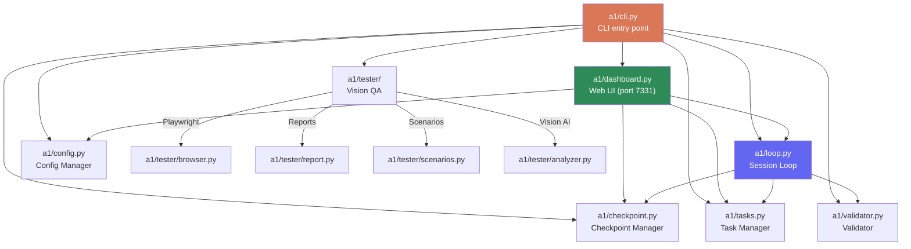

# PocketCoder-A1 Technical Documentation

## Table of Contents

1. [Overview](#1-overview)
2. [Architecture Diagram](#2-architecture-diagram)
3. [Installation](#3-installation)
4. [CLI Reference](#4-cli-reference)
5. [Dashboard Pages](#5-dashboard-pages)
6. [API Reference](#6-api-reference)
7. [Data Model](#7-data-model)
8. [Agent Loop Protocol](#8-agent-loop-protocol)
9. [Providers](#9-providers)
10. [Configuration](#10-configuration)
11. [Vision QA Tester](#11-vision-qa-tester)
12. [Stream-JSON Format](#12-stream-json-format)

---

## 1. Overview

**PocketCoder-A1** is an autonomous coding agent built in Python. It launches a Claude CLI subprocess, streams real-time output to a web dashboard, verifies results with a 3-tier gate, and persists state between sessions via JSON checkpoint files.

| Attribute | Value |
|-----------|-------|
| Version | 0.2.0 |
| Codename | Autonomous Gnome |
| Language | Python 3.8+ |
| Total lines | ~4882 across 13 modules |
| License | MIT |
| Author | Dmitry Chashchin |
| Repository | https://github.com/Chashchin-Dmitry/pocketcoder-a1 |

### Module Line Counts

| Module | Lines | Purpose |
|--------|-------|---------|
| `a1/__init__.py` | 6 | Version and codename constants |
| `a1/loop.py` | ~1152 | Core: subprocess management, stream parsing, verification, 3 providers |
| `a1/dashboard.py` | ~3186 | Web UI: 8 pages, 20+ API endpoints, 6 metric cards, live logs |
| `a1/validator.py` | 362 | Validation: syntax, tests, lint, build, git, criteria checks |
| `a1/cli.py` | 369 | CLI: 10 subcommands with argparse |
| `a1/tasks.py` | 212 | Task CRUD: add, update, reorder, priority, progress |
| `a1/checkpoint.py` | 147 | Session state: load, save, archive, summary |
| `a1/config.py` | 127 | Configuration: load/save/resolve with priority chain |
| `a1/tester/runner.py` | 420 | Vision QA: 7 scenarios with Playwright |
| `a1/tester/scenarios.py` | 204 | Scenario definitions (data classes) |
| `a1/tester/report.py` | 194 | HTML/JSON report generation |
| `a1/tester/analyzer.py` | 143 | Claude Vision API for screenshot analysis |
| `a1/tester/browser.py` | 125 | Playwright headless Chromium wrapper |

### Key Features

- Autonomous work without human intervention (Claude CLI subprocess)
- Real-time web dashboard with 6 metric cards, live terminal log, and task management
- Three AI providers: Claude Max (CLI), Claude API, Ollama (local)
- Post-session verification with 3-tier gate ("don't trust, verify")
- Anti-infinite-loop protection (baseline comparison + max 3 retries + force-accept)
- Context monitoring with auto-checkpoint at 70% context window usage
- Vision-based QA tester using Playwright and Claude Vision
- Checkpoint/task persistence between sessions
- HTML5 drag-and-drop task reordering
- AI-powered text-to-tasks transformation

---

## 2. Architecture Diagram

### Module Dependency Graph



### Data Flow

```mermaid
sequenceDiagram
    participant User
    participant CLI as pca CLI
    participant Dashboard as Web Dashboard
    participant Loop as Session Loop
    participant Claude as Claude Subprocess
    participant CP as Checkpoint
    participant Tasks as Task Manager
    participant Val as Validator

    User->>CLI: pca start
    CLI->>Loop: SessionLoop.start()
    Loop->>CP: capture_baseline()
    Loop->>Val: run_all() [pre-existing issues]

    loop For each session
        Loop->>CP: start_session()
        Loop->>Tasks: get_summary()
        Loop->>Loop: build_prompt()
        Loop->>Claude: subprocess.Popen(claude -p ...)
        Claude-->>Loop: stream-json NDJSON events
        Loop-->>Dashboard: _log_callback() [real-time]
        Loop->>Loop: _parse_stream_event() [metrics]
        Claude-->>Loop: process exits
        Loop->>Val: _verify_session()
        alt Verification PASSED
            Loop->>CP: mark_completed()
            Loop-->>User: ALL TASKS COMPLETED
        else Verification FAILED
            Loop->>CP: status = WORKING
            Loop->>Loop: inject errors into next prompt
        end
    end

    User->>CLI: pca ui
    CLI->>Dashboard: run_dashboard()
    Dashboard-->>User: http://localhost:7331
    User->>Dashboard: POST /start
    Dashboard->>Loop: SessionLoop.start() [in thread]
    Dashboard-->>User: AJAX polling /api/status, /api/log
```

### File System Layout

```
project/
+-- .a1/                           # Created by `pca init`
|   +-- checkpoint.json            # Session state
|   +-- tasks.json                 # Task list
|   +-- config.json                # User configuration
|   +-- queue.json                 # Message queue for agent
|   +-- sessions/
|   |   +-- session_001.log        # Raw agent NDJSON output
|   |   +-- session_002.log
|   +-- checkpoints/
|   |   +-- session_001.json       # Checkpoint archive per session
|   |   +-- session_002.json
|   +-- test-reports/
|       +-- latest.html            # Most recent vision QA report
|       +-- latest.json
|       +-- report_20260225_143000.html
+-- .claude/
|   +-- settings.local.json        # MCP server config
+-- .mcp.json                      # Playwright MCP config
```

---

## 3. Installation

### Prerequisites

- Python 3.8 or later
- Claude Code CLI (for claude-max provider): `npm install -g @anthropic-ai/claude-code`
- A Claude Max subscription, Anthropic API key, or local Ollama instance

### Install from Source

```bash
git clone https://github.com/Chashchin-Dmitry/pocketcoder-a1.git
cd pocketcoder-a1

# Create virtual environment (recommended)
python -m venv .venv
source .venv/bin/activate  # Linux/macOS
# .venv\Scripts\activate   # Windows

# Install in editable mode
pip install -e .
```

### Optional Dependencies

```bash
# For development (pytest, ruff)
pip install -e ".[dev]"

# For Claude API provider
pip install -e ".[api]"

# For Ollama provider
pip install -e ".[ollama]"

# For vision QA tester
pip install -e ".[test]"
playwright install chromium
```

### Verify Installation

```bash
pca --version
# pca 0.2.0
```

### Quick Start

```bash
cd /path/to/your/project
pca init .
pca task add "Create health endpoint"
pca task add "Write unit tests"
pca start
```

---

## 4. CLI Reference

The CLI entry point is `pca` (registered in `pyproject.toml` as `a1.cli:main`).

### Global Flags

| Flag | Default | Description |
|------|---------|-------------|
| `-V`, `--version` | -- | Show version and exit |
| `-p`, `--project` | `.` (current dir) | Project directory |

### `pca init [dir]`

Initialize A1 in a project directory. Creates the `.a1/` directory structure with `sessions/` and `checkpoints/` subdirectories, and initializes empty `checkpoint.json` and `tasks.json`.

```bash
pca init .
pca init /path/to/project
```

### `pca think <thought...>`

Add a raw thought for later transformation into structured tasks via the AI Transform feature.

```bash
pca think "Need to add authentication with JWT tokens"
pca think "Fix the responsive layout on mobile"
```

### `pca task add <title...> [-d DESCRIPTION]`

Add a specific task with an optional description. Priority is auto-assigned as the next highest number.

```bash
pca task add "Create health endpoint"
pca task add "Write integration tests" -d "Cover all API endpoints with pytest"
```

### `pca tasks`

Display all tasks with their status, priority, and success criteria. Tasks are sorted by status (pending first) and priority.

```bash
pca tasks
```

Output example:
```
## Tasks (1/3 completed)
[ ] [task_001] Create health endpoint
    SUCCESS CRITERIA: pytest passes
[~] [task_002] Write unit tests
[x] [task_003] Fix linting errors
```

### `pca start [flags]`

Start the autonomous agent loop. The agent picks up pending tasks (lowest priority number first) and works on them sequentially, verifying results after each session.

| Flag | Default | Description |
|------|---------|-------------|
| `--provider` | `claude-max` | AI provider: `claude-max`, `claude-api`, `ollama` |
| `--max-sessions` | `100` | Maximum number of sessions before stopping |
| `--model` | provider-dependent | Model name override |
| `--api-key` | `None` | Anthropic API key (or set `ANTHROPIC_API_KEY` env) |
| `--ollama-host` | `http://localhost:11434` | Ollama server URL |
| `--ollama-model` | `qwen3:30b-a3b` | Ollama model name |
| `--max-turns` | `25` | Max tool-use turns per session |
| `--session-delay` | `5` | Delay in seconds between sessions |

```bash
pca start                                   # Claude Max (default)
pca start --provider claude-api --api-key sk-ant-...
pca start --provider ollama --ollama-model llama3
pca start --max-sessions 5 --max-turns 10
```

### `pca status [-v]`

Show current checkpoint status including session number, task progress, and files modified.

| Flag | Description |
|------|-------------|
| `-v`, `--validate` | Also run validation checks |

```bash
pca status
pca status -v
```

### `pca validate`

Run all validation checks (syntax, tests, lint, build, git) and display results.

```bash
pca validate
```

### `pca log [-s SESSION]`

Show session history. Without `-s`, lists the last 10 sessions. With `-s`, displays the full checkpoint JSON for that session.

```bash
pca log           # List sessions
pca log -s 3      # Show session #3 details
```

### `pca config [key] [value] [--reset]`

View or edit configuration stored in `.a1/config.json`.

```bash
pca config                       # Show all config
pca config provider              # Show specific key
pca config provider claude-api   # Set value
pca config api_key sk-ant-...    # Set API key
pca config --reset               # Reset to defaults
```

Type auto-conversion: `true`/`false` become booleans, `null`/`none` become None, numeric strings become int/float.

### `pca ui [flags]`

Launch the web dashboard.

| Flag | Default | Description |
|------|---------|-------------|
| `--port` | auto (starts at 7331) | Dashboard port |
| `--no-browser` | `False` | Do not auto-open browser |

```bash
pca ui                        # Open browser automatically
pca ui --no-browser           # Server only
pca ui --port 8080            # Custom port
pca ui -p /path/to/project    # Specific project
```

The dashboard binds to `0.0.0.0` for remote access. If the requested port is in use, it auto-finds the next free port (up to 20 attempts).

### `pca test [-s SCENARIO] [--port PORT]`

Run E2E vision tests using real Playwright Chromium browser against the running dashboard.

| Flag | Default | Description |
|------|---------|-------------|
| `-s`, `--scenario` | `None` (all) | Run specific scenario (1-7) |
| `--port` | `7331` | Dashboard port to test against |

```bash
pca test           # Run all 7 scenarios
pca test -s 1      # Run only scenario #1
pca test -s 7      # Run only API test
```

Requires the dashboard to be running (`pca ui`) before executing tests.

---

## 5. Dashboard Pages

The dashboard is a single-binary web server built on Python's `http.server`. All HTML is generated server-side using `string.Template` with CSS variables for theming. AJAX polling handles live updates.

### Page 1: Dashboard (`/`)

The main overview page with 6 metric cards, task list, quick-add form, agent controls, message queue, terminal log panel, and activity log.

**Features:**
- 6 metric cards: Tasks (progress bar), Session (#N + status), Tokens (in/out + context %), Cost ($), Duration (live timer), Files (modified count)
- Start/Stop agent buttons (toggle based on state)
- Quick Add form (title + description textarea)
- Message to Agent form (visible only when agent is running)
- Terminal-style live log panel with colored icons per event type
- Raw log toggle
- Recent Activity section (last 5 entries)
- AJAX polling: status every 3s, log every 2s, timer every 1s

### Page 2: Tasks (`/tasks`)

Full task management page with drag-and-drop reordering.

**Features:**
- All tasks sorted by status (pending first) then priority
- Each task links to its detail page (`/task/{id}`)
- Priority badges (#N)
- Status icons (check for done, arrow-repeat for in_progress)
- HTML5 drag-and-drop reordering (POST /api/reorder on drop)
- Raw Thoughts section (if any exist)
- Add Task form (title + description)
- Add Thought form
- Bulk Add Tasks textarea (one task per line, auto-priority)

### Page 3: Task Detail (`/task/{task_id}`)

Dedicated page for a single task with execution logs, metrics, and session history.

**Features:**
- Task metadata: description, success criteria, phase, created/completed dates
- Status badge (pending/in_progress/done) with color coding
- Priority display
- Start Task button (starts agent on this specific task)
- Stop button (if task is currently active)
- 4 metric cards: Tool Calls, Sessions, Tokens In, Tokens Out
- Execution Log: filtered entries for this task with colored type labels
- Live log updates via AJAX polling (2s interval) when task is active
- Session History: all sessions that worked on this task with per-session metrics
- Green pulsing dot indicator when task is actively being worked on

### Page 4: Sessions (`/sessions`)

Session history with per-session metrics.

**Features:**
- Current session card with status badge, highlighted with accent border
- Previous sessions (last 10) with cards showing:
  - Session number and status badge
  - Files modified count
  - Current task
  - Token usage (in/out formatted as K/M)
  - Duration (formatted as Xm Ys)
  - Tool call count

### Page 5: Activity Log (`/log`)

Full activity timeline showing all dashboard-level events.

**Features:**
- All activity entries (newest first)
- Status icons: success (green check), error (red X), warning (yellow triangle), info (orange circle)
- Timestamp, action name, and details for each entry
- Auto-refresh every 5 seconds

### Page 6: Commits (`/commits`)

Git commit history for the project.

**Features:**
- Last 20 commits from `git log`
- Conventional commit icons: feat (green plus), fix (red bug), docs (orange file), refactor/chore (yellow arrow), test (blue check)
- Commit hash, message, relative time, author
- Current branch name displayed in header

### Page 7: Settings (`/settings`)

Configuration management page with live save.

**Features:**
- Provider selector (claude-max, claude-api, ollama) with AJAX save
- API Key input (masked display, password field) -- conditionally shown for claude-api
- Ollama config (host URL + model) -- conditionally shown for ollama
- Session config grid: max_sessions, max_turns, session_delay, context_threshold
- Theme toggle button
- Config file path display
- Toast notifications on save
- All changes saved immediately via POST /api/config

### Page 8: Transform (`/transform`)

AI-powered text-to-tasks transformation.

**Features:**
- 3-step visual workflow: Write -> Transform -> Confirm
- Large textarea for raw text input
- "AI Transform" button calls Claude CLI to break text into structured tasks
- Preview panel with checkboxes for each generated task
- "Add Selected" button to confirm and add tasks to queue
- Status messages during processing

---

## 6. API Reference

All API endpoints are served by `DashboardHandler` in `a1/dashboard.py`.

### GET Endpoints

#### `GET /`

Returns the dashboard HTML page.

**Response:** `200 OK`, `Content-Type: text/html; charset=utf-8`

#### `GET /tasks`

Returns the tasks management HTML page.

**Response:** `200 OK`, `Content-Type: text/html; charset=utf-8`

#### `GET /task/{task_id}`

Returns the task detail HTML page for a specific task.

**URL Pattern:** `/task/task_001`, `/task/task_042`

**Response:** `200 OK`, `Content-Type: text/html; charset=utf-8`

Returns "Task not found" page if the task_id does not exist.

#### `GET /sessions`

Returns the sessions history HTML page.

**Response:** `200 OK`, `Content-Type: text/html; charset=utf-8`

#### `GET /log`

Returns the activity log HTML page.

**Response:** `200 OK`, `Content-Type: text/html; charset=utf-8`

#### `GET /commits`

Returns the git commits HTML page.

**Response:** `200 OK`, `Content-Type: text/html; charset=utf-8`

#### `GET /settings`

Returns the settings HTML page.

**Response:** `200 OK`, `Content-Type: text/html; charset=utf-8`

#### `GET /transform`

Returns the transform (text-to-tasks) HTML page.

**Response:** `200 OK`, `Content-Type: text/html; charset=utf-8`

#### `GET /api/status`

Returns full system status as JSON, including checkpoint, tasks, metrics, and running state.

**Response:** `200 OK`, `Content-Type: application/json`

```json
{
  "checkpoint": {
    "status": "WORKING",
    "session": 3,
    "current_task": "task_002",
    "files_modified": ["src/api.py", "tests/test_api.py"],
    "decisions": ["Combined tasks 1+2"],
    "context_percent": 45,
    "session_metrics": {
      "tokens_in": 12400,
      "tokens_out": 3200,
      "cache_read": 8000,
      "cache_creation": 1500,
      "tools_used": 58,
      "session_duration": 166
    },
    "updated_at": "2026-02-25T14:30:00.000000"
  },
  "tasks": [
    {
      "id": "task_001",
      "title": "Add health endpoint",
      "description": "Create /api/health...",
      "status": "done",
      "priority": 1,
      "created_at": "2026-02-25T10:00:00.000000",
      "completed_at": "2026-02-25T10:15:00.000000",
      "success_criteria": "pytest passes",
      "phase": null,
      "raw_thought": null
    }
  ],
  "progress": [1, 3],
  "running": true,
  "activity": [
    {
      "time": "14:30:00",
      "action": "Agent started",
      "details": "task: task_002",
      "status": "success"
    }
  ],
  "metrics": {
    "tokens_in": 12400,
    "tokens_out": 3200,
    "cache_read": 8000,
    "cache_creation": 1500,
    "tools_used": 58,
    "session_start": 1740495000.0,
    "session_duration": 166,
    "context_percent": 0.062,
    "context_overflow": false
  }
}
```

```bash
curl http://localhost:7331/api/status
```

#### `GET /api/log?since=N`

Returns agent log entries from index N. Used for incremental AJAX polling.

**Query Parameters:**
- `since` (int, default: 0): Starting index into the log buffer

**Response:** `200 OK`, `Content-Type: application/json`

```json
{
  "entries": [
    {
      "time": "14:30:05",
      "line": "[Read] /src/api.py",
      "type": "read",
      "task_id": "task_002"
    },
    {
      "time": "14:30:08",
      "line": "[Edit] /src/api.py",
      "type": "edit",
      "task_id": "task_002"
    }
  ],
  "total": 42,
  "since": 40
}
```

```bash
curl "http://localhost:7331/api/log?since=0"
```

#### `GET /api/config`

Returns current configuration with API key masked.

**Response:** `200 OK`, `Content-Type: application/json`

```json
{
  "provider": "claude-max",
  "model": null,
  "api_key": "sk-ant-api0...xxxx",
  "ollama_host": "http://localhost:11434",
  "ollama_model": "qwen3:30b-a3b",
  "max_sessions": 100,
  "max_turns": 25,
  "session_delay": 5,
  "context_threshold": 0.70,
  "_defaults": {
    "provider": "claude-max",
    "model": null,
    "api_key": null,
    "ollama_host": "http://localhost:11434",
    "ollama_model": "qwen3:30b-a3b",
    "max_sessions": 100,
    "max_turns": 25,
    "session_delay": 5,
    "context_threshold": 0.70
  }
}
```

```bash
curl http://localhost:7331/api/config
```

#### `GET /api/task/{task_id}`

Returns detailed JSON for a single task, including filtered logs, metrics, and session history.

**URL Pattern:** `/api/task/task_001`

**Response:** `200 OK`, `Content-Type: application/json`

```json
{
  "task": {
    "id": "task_001",
    "title": "Add health endpoint",
    "description": "Create /api/health",
    "status": "done",
    "priority": 1,
    "created_at": "2026-02-25T10:00:00",
    "completed_at": "2026-02-25T10:15:00",
    "success_criteria": "pytest passes",
    "phase": null,
    "raw_thought": null
  },
  "logs": [
    {"time": "10:01:05", "line": "[Read] /src/api.py", "type": "read", "task_id": "task_001"}
  ],
  "log_count": 24,
  "metrics": {
    "tool_types": {"read": 5, "edit": 3, "bash": 8, "text": 6, "thinking": 2},
    "tool_count": 16
  },
  "sessions": [
    {
      "session": 1,
      "status": "WORKING",
      "metrics": {"tokens_in": 5000, "tokens_out": 1200, "tools_used": 16, "session_duration": 45}
    }
  ],
  "is_active": false
}
```

Returns `404` with `{"error": "Task not found"}` if the task does not exist.

```bash
curl http://localhost:7331/api/task/task_001
```

### POST Endpoints

#### `POST /add-task`

Add a new task. Accepts form-encoded data.

**Content-Type:** `application/x-www-form-urlencoded`

**Parameters:**
- `task` (string, required): Task title
- `description` (string, optional): Task description

**Response:** `302 Found` redirect to `/`

```bash
curl -X POST http://localhost:7331/add-task \
  -d "task=Create+health+endpoint&description=Return+200+OK"
```

#### `POST /add-thought`

Add a raw thought for later transformation.

**Content-Type:** `application/x-www-form-urlencoded`

**Parameters:**
- `thought` (string, required): Raw thought text

**Response:** `302 Found` redirect to `/`

```bash
curl -X POST http://localhost:7331/add-thought \
  -d "thought=Need+to+add+JWT+authentication"
```

#### `POST /add-tasks-bulk`

Add multiple tasks at once (one per line). Leading list markers (`- `, `* `, `1.`, `2)`) are stripped.

**Content-Type:** `application/x-www-form-urlencoded`

**Parameters:**
- `tasks_bulk` (string, required): Newline-separated task titles

**Response:** `302 Found` redirect to `/tasks`

```bash
curl -X POST http://localhost:7331/add-tasks-bulk \
  -d "tasks_bulk=Add+login+page%0AWrite+unit+tests%0AFix+responsive+layout"
```

#### `POST /start`

Start the autonomous agent. Creates a `SessionLoop` in a daemon thread using resolved configuration. Clears the log buffer, sets `current_task` from the next pending task, and logs the start event.

**Response:** `302 Found` redirect to `/`

```bash
curl -X POST http://localhost:7331/start
```

#### `POST /start-task/{task_id}`

Start the agent on a specific task. Sets the task to `in_progress`, updates `current_task` in checkpoint, and starts the agent if not already running.

**URL Pattern:** `/start-task/task_003`

**Response:** `200 OK`, `Content-Type: application/json`

```json
{"ok": true, "task_id": "task_003"}
```

```bash
curl -X POST http://localhost:7331/start-task/task_003
```

#### `POST /stop`

Stop the running agent. Calls `loop.stop()` which terminates the subprocess and sets `_running = False`.

**Response:** `302 Found` redirect to `/`

```bash
curl -X POST http://localhost:7331/stop
```

#### `POST /queue-message`

Queue a message for the running agent. The message is read by `_read_queue_messages()` and injected into the next session prompt.

**Content-Type:** `application/x-www-form-urlencoded`

**Parameters:**
- `message` (string, required): Message text

**Response:** `200 OK`, `Content-Type: application/json`

```json
{"ok": true}
```

```bash
curl -X POST http://localhost:7331/queue-message \
  -d "message=Please+also+add+error+handling"
```

#### `POST /api/reorder`

Reorder tasks by providing a new ordering of task IDs. Priorities are reassigned based on position (first = priority 1).

**Content-Type:** `application/json`

**Request Body:**
```json
{"order": ["task_003", "task_001", "task_002"]}
```

**Response:** `200 OK`, `Content-Type: application/json`

```json
{"ok": true}
```

```bash
curl -X POST http://localhost:7331/api/reorder \
  -H "Content-Type: application/json" \
  -d '{"order": ["task_003", "task_001", "task_002"]}'
```

#### `POST /api/config`

Update configuration values. Saves to `.a1/config.json`.

**Content-Type:** `application/json`

**Request Body:** Object with config keys to update.

```json
{"provider": "claude-api", "max_sessions": 50}
```

**Response:** `200 OK`, `Content-Type: application/json`

```json
{"ok": true}
```

On error: `400 Bad Request` with `{"error": "..."}`.

```bash
curl -X POST http://localhost:7331/api/config \
  -H "Content-Type: application/json" \
  -d '{"provider": "claude-api", "api_key": "sk-ant-api03-..."}'
```

#### `POST /transform`

Transform raw text into structured tasks using Claude CLI.

**Content-Type:** `application/x-www-form-urlencoded`

**Parameters:**
- `text` (string, required): Raw text to transform

**Response:** `200 OK`, `Content-Type: application/json`

```json
{
  "tasks": [
    {"title": "Add login page", "description": "Create login page with email/password fields"},
    {"title": "Write unit tests", "description": "Cover auth module with pytest tests"}
  ]
}
```

On error:
```json
{"tasks": [], "error": "Claude CLI not found"}
```

```bash
curl -X POST http://localhost:7331/transform \
  -d "text=Add+login+page+with+email+and+password"
```

#### `POST /transform-confirm`

Confirm and add transformed tasks to the task list.

**Content-Type:** `application/json`

**Request Body:**
```json
{
  "tasks": [
    {"title": "Add login page", "description": "Create login page with fields"},
    {"title": "Write unit tests", "description": "Cover auth module"}
  ]
}
```

**Response:** `200 OK`, `Content-Type: application/json`

```json
{"ok": true, "added": 2}
```

```bash
curl -X POST http://localhost:7331/transform-confirm \
  -H "Content-Type: application/json" \
  -d '{"tasks":[{"title":"Add login page","description":"With email/password"}]}'
```

---

## 7. Data Model

### checkpoint.json

Located at `.a1/checkpoint.json`. Stores session state, metrics, and agent decisions. Archived to `.a1/checkpoints/session_NNN.json` on every save.

```json
{
  "status": "IDLE|STARTING|WORKING|COMPLETED",
  "session": 3,
  "current_task": "task_002",
  "context_percent": 45,
  "files_modified": ["src/api.py", "tests/test_api.py"],
  "decisions": [
    "Combined tasks 1+2 for efficiency",
    "Used pytest fixtures for test setup"
  ],
  "next_steps": [
    "Implement pagination",
    "Add error handling"
  ],
  "last_action": "Completed health endpoint + tests",
  "created_at": "2026-02-25T10:00:00.000000",
  "updated_at": "2026-02-25T14:30:00.000000",
  "session_started_at": "2026-02-25T14:25:00.000000",
  "session_ended_at": "2026-02-25T14:30:00.000000",
  "completed_at": "2026-02-25T14:30:00.000000",
  "session_metrics": {
    "tokens_in": 12400,
    "tokens_out": 3200,
    "cache_read": 8000,
    "cache_creation": 1500,
    "tools_used": 58,
    "session_duration": 166,
    "session_start": 1740495000.0,
    "context_percent": 0.062
  },
  "last_verification": {
    "passed": false,
    "blocking_issues": ["syntax: Syntax errors in 1 files"],
    "warnings": ["lint: Lint issues: 3"],
    "retry_count": 1,
    "session": 3
  }
}
```

**Field Reference:**

| Field | Type | Description |
|-------|------|-------------|
| `status` | string | `STARTING`, `IDLE`, `WORKING`, or `COMPLETED` |
| `session` | int | Current session number (incremented on each start) |
| `current_task` | string or null | ID of the task being worked on |
| `context_percent` | int | Context window usage percentage (0-100) |
| `files_modified` | string[] | List of file paths modified across all sessions |
| `decisions` | string[] | Key decisions made by the agent (last 20 kept) |
| `next_steps` | string[] | Planned next steps |
| `last_action` | string or null | Description of the last action performed |
| `session_metrics` | object | Token and timing metrics for the current/last session |
| `last_verification` | object or null | Result of last post-session verification |

### tasks.json

Located at `.a1/tasks.json`. Stores the task list and raw thoughts.

```json
{
  "raw_thoughts": [
    {
      "text": "Need to add JWT authentication",
      "added_at": "2026-02-25T10:00:00.000000"
    }
  ],
  "tasks": [
    {
      "id": "task_001",
      "title": "Add health endpoint",
      "description": "Create /api/health that returns 200 OK",
      "status": "done",
      "priority": 1,
      "created_at": "2026-02-25T10:00:00.000000",
      "completed_at": "2026-02-25T10:15:00.000000",
      "raw_thought": null,
      "phase": "2.1",
      "success_criteria": "pytest passes"
    },
    {
      "id": "task_002",
      "title": "Write unit tests",
      "description": "Cover all endpoints",
      "status": "in_progress",
      "priority": 2,
      "created_at": "2026-02-25T10:01:00.000000",
      "completed_at": null,
      "raw_thought": null,
      "phase": null,
      "success_criteria": "100% of endpoints tested"
    }
  ],
  "next_id": 3
}
```

**Task Fields:**

| Field | Type | Description |
|-------|------|-------------|
| `id` | string | Unique ID in format `task_NNN` |
| `title` | string | Short task title |
| `description` | string | Detailed description |
| `status` | string | `pending`, `in_progress`, `done`, or `blocked` |
| `priority` | int | Priority number (lower = higher priority). Auto-assigned |
| `created_at` | string | ISO 8601 timestamp |
| `completed_at` | string or null | ISO 8601 timestamp when completed |
| `raw_thought` | string or null | Original thought text if created from transform |
| `phase` | string or null | Phase identifier (e.g., "2.1") |
| `success_criteria` | string or null | Verifiable success criteria |

**Task Ordering:** `get_next_task()` returns the task with status `in_progress` (lowest priority) first, then `pending` (lowest priority).

### queue.json

Located at `.a1/queue.json`. Created when a message is sent to the agent via the dashboard or API. Read and marked as read by `_read_queue_messages()` at the start of each session.

```json
{
  "messages": [
    {
      "text": "Please also add error handling to the endpoint",
      "added_at": "2026-02-25T14:28:00.000000",
      "read": false
    },
    {
      "text": "Use try/except blocks",
      "added_at": "2026-02-25T14:29:00.000000",
      "read": true
    }
  ]
}
```

### Session Log Format

Located at `.a1/sessions/session_NNN.log`. Contains raw NDJSON output from the Claude CLI subprocess (one JSON object per line).

For `claude-max` provider, each line is a stream-json event:
```json
{"type":"system","subtype":"init","apiKeySource":"...","model":"..."}
{"type":"assistant","message":{"content":[{"type":"tool_use","name":"Read","input":{"file_path":"/src/api.py"}}]}}
{"type":"assistant","message":{"content":[{"type":"text","text":"I'll create the health endpoint..."}]}}
{"type":"rate_limit_event","usage":{"input_tokens":5000,"output_tokens":1200,"cache_read_input_tokens":3000}}
{"type":"result","result":"Task completed successfully."}
```

For `claude-api` provider, each line is a turn log:
```json
{"turn": 0, "stop_reason": "tool_use", "usage": {"in": 5000, "out": 800}}
[tool] [Read] /src/api.py
[text] I'll create the health endpoint...
[result] Read: <file contents>
```

---

## 8. Agent Loop Protocol

The agent loop is implemented in `SessionLoop.start()` in `a1/loop.py`. It runs an autonomous cycle of: build prompt -> run Claude session -> verify results -> decide next action.

### Step-by-Step Flow

```
1. INITIALIZATION
   +-- _capture_baseline()
   |   Run validator.run_all() BEFORE any work
   |   Record pre-existing failures (syntax, tests, lint, build, git)
   |   These are excluded from verification failures later
   +-- Print activation banner

2. SESSION LOOP (while _running and session_count < max_sessions)
   +-- checkpoint.start_session()
   |   Increment session number, set status=WORKING
   |
   +-- build_prompt(is_first)
   |   Assemble: checkpoint summary + tasks summary + queue messages
   |   + verification errors from last session (if any)
   |   First session gets full protocol instructions
   |   Subsequent sessions get continuation prompt
   |
   +-- run_session(prompt)
   |   Dispatch to provider: _run_claude_max / _run_claude_api / _run_ollama
   |   Stream output in real-time
   |   Parse NDJSON events -> extract metrics + log entries
   |   Monitor context window usage
   |   If context >= 70%: auto-checkpoint + terminate session
   |
   +-- Save session_metrics to checkpoint
   |
   +-- _verify_session()  [POST-SESSION VERIFICATION]
   |   See Verification System below
   |
   +-- Decision:
       |-- checkpoint says COMPLETED + verification PASSED
       |   -> Stop loop, print success
       |-- checkpoint says COMPLETED + verification FAILED
       |   -> Reset status to WORKING
       |   -> Save blocking_issues + retry_count to checkpoint
       |   -> Continue to next session (errors injected into prompt)
       |-- Not completed
       |   -> Sleep session_delay seconds
       |   -> Continue to next session

3. TERMINATION
   +-- Print final status (tasks done/total, sessions count)
```

### Verification System ("Don't Trust, Verify")

After each session, `_verify_session()` runs automated checks in three tiers:

**Tier 1 -- BLOCKING (must pass to accept completion):**

| Check | Method | What it does |
|-------|--------|-------------|
| `syntax` | `validator._check_syntax()` | `py_compile` on all `.py` files |
| `tests` | `validator._run_tests()` | `pytest -v --tb=short` (fallback: unittest) |
| `files_exist` | `validator.check_files_exist()` | Verify all `files_modified` from checkpoint exist on disk |
| `success_criteria` | `validator.check_criteria()` | Heuristic check per task's success_criteria field |
| `tasks_complete` | progress check | If checkpoint says COMPLETED, verify done == total |

**Tier 2 -- WARNING (logged but do not block):**

| Check | Method | What it does |
|-------|--------|-------------|
| `lint` | `validator._run_lint()` | `ruff check .` (fallback: flake8) |
| `build` | `validator._check_build()` | `python -m build` or `npm run build` |
| `git` | `validator._check_git()` | `git diff --stat` + `git status --porcelain` |

**Tier 3 -- ANTI-LOOP:**

| Mechanism | Description |
|-----------|-------------|
| Baseline comparison | Pre-existing failures (captured before first session) are excluded from blocking |
| Max retries | After `MAX_VERIFY_RETRIES` (3) failed attempts, force-accept the result |
| Prompt injection | Failed verification details are injected into the next session's prompt |

### Verification Return Value

```python
{
    "passed": bool,           # True if no blocking issues or force-accepted
    "force_accepted": bool,   # True if max retries exceeded
    "blocking_issues": [],    # List of blocking failure messages
    "warnings": [],           # List of warning messages
    "retry_count": int,       # Current retry attempt number
    "summary": str,           # Human-readable summary
}
```

### Context Monitoring

The `SessionLoop` monitors context window usage via `rate_limit_event` tokens:

- **Context window size:** 200,000 tokens (constant `CONTEXT_WINDOW_SIZE`)
- **Threshold:** 70% (configurable via `context_threshold` in config)
- **Calculation:** `context_percent = input_tokens / CONTEXT_WINDOW_SIZE`
- **Auto-checkpoint trigger:** When `context_percent >= CONTEXT_THRESHOLD`:
  1. Set `_context_overflow = True`
  2. Log warning to dashboard
  3. Save checkpoint with context metrics and status=WORKING
  4. Terminate the Claude subprocess
  5. Return exit code 0 (clean exit, not an error)
  6. The next session picks up from the checkpoint

### Prompt Structure

**First session prompt includes:**
- Language rule (respond in user's language)
- Project working directory
- Full tasks summary with priorities
- Protocol instructions (read CLAUDE.md, TODO.md, pick tasks, validate)
- How to update tasks.json and checkpoint.json
- Validation commands (py_compile, pytest, ruff)
- Success criteria instructions
- Task priority ordering rule
- Max turns warning
- Verification errors from previous session (if any)
- Queue messages (if any)

**Continuation session prompt includes:**
- Checkpoint summary (status, current task, files, decisions)
- Tasks summary
- Condensed protocol instructions
- Verification errors from previous session (if any)
- Queue messages (if any)

---

## 9. Providers

PocketCoder-A1 supports three AI providers for the autonomous agent loop.

### claude-max (Default)

Uses Claude Code CLI as a subprocess. Requires a Claude Max subscription.

**Command:**
```bash
claude -p <prompt> \
  --dangerously-skip-permissions \
  --no-session-persistence \
  --max-turns 25 \
  --verbose \
  --output-format stream-json
```

**Critical environment fix:** The `CLAUDECODE` environment variable is removed (`env.pop("CLAUDECODE", None)`) before launching the subprocess to prevent the nested session crash.

**Features:**
- Full tool-use support (Read, Edit, Write, Bash, Glob, Grep, etc.)
- Real-time NDJSON streaming
- Token metrics via `rate_limit_event`
- Context monitoring

**CLI flags reference:**

| Flag | Purpose |
|------|---------|
| `-p prompt` | Non-interactive mode |
| `--dangerously-skip-permissions` | Auto-approve all tool calls |
| `--verbose` | Required for stream-json with `-p` |
| `--output-format stream-json` | Real-time NDJSON output |
| `--max-turns 25` | Prevent infinite work |
| `--no-session-persistence` | Don't save to Claude session history |

### claude-api [EXPERIMENTAL]

Uses the Anthropic Python SDK directly. Requires an API key.

**Requirements:**
```bash
pip install anthropic
```

**Configuration:**
- `api_key`: via CLI flag `--api-key`, env var `ANTHROPIC_API_KEY`, or config `pca config api_key sk-ant-...`
- `model`: defaults to `claude-sonnet-4-20250514`

**Features:**
- Full agentic loop with 6 tools: Read, Write, Edit, Bash, Glob, Grep
- Streaming via `client.messages.stream()`
- Tool execution in PocketCoder's process (no subprocess)
- Token metrics from `response.usage`
- Context monitoring

**Limitations:**
- Tool execution is simplified (no MCP integration)
- Grep uses system `grep` command, not ripgrep
- Edit requires exact unique string match

### ollama [EXPERIMENTAL]

Uses a local Ollama instance for text generation. No tool-use support.

**Requirements:**
```bash
pip install ollama
ollama serve   # Must be running
ollama pull qwen3:30b-a3b  # Or your preferred model
```

**Configuration:**
- `ollama_host`: defaults to `http://localhost:11434`
- `ollama_model`: defaults to `qwen3:30b-a3b`

**Features:**
- Streaming text output
- Token metrics from Ollama response
- Completely local, no API key needed

**Limitations:**
- No tool-use (model generates text instructions but cannot execute them)
- Context window fixed at 32,768 tokens (via `num_ctx` option)
- Requires manual execution of suggested changes

### Config Resolution Order

Configuration values are resolved with the following priority (highest first):

```
1. CLI flags        (--provider, --max-turns, etc.)
2. Environment vars (ANTHROPIC_API_KEY, OLLAMA_HOST, OLLAMA_MODEL)
3. Config file      (.a1/config.json)
4. Defaults         (hardcoded in config.py DEFAULTS)
```

---

## 10. Configuration

### Config File: `.a1/config.json`

Stored per-project. Created/modified by `pca config` or the Settings page.

**All Configuration Fields:**

| Key | Type | Default | Description |
|-----|------|---------|-------------|
| `provider` | string | `"claude-max"` | AI provider: `claude-max`, `claude-api`, `ollama` |
| `model` | string or null | `null` | Model name override (provider-specific) |
| `api_key` | string or null | `null` | Anthropic API key |
| `ollama_host` | string | `"http://localhost:11434"` | Ollama server URL |
| `ollama_model` | string | `"qwen3:30b-a3b"` | Default Ollama model |
| `max_sessions` | int | `100` | Maximum sessions per `pca start` run |
| `max_turns` | int | `25` | Maximum tool-use turns per session |
| `session_delay` | int | `5` | Delay in seconds between sessions |
| `context_threshold` | float | `0.70` | Context window usage threshold for auto-checkpoint (0.0 - 1.0) |

### CLI Flags

All flags for `pca start`:

| CLI Flag | Config Key | Env Var |
|----------|-----------|---------|
| `--provider` | `provider` | -- |
| `--model` | `model` | -- |
| `--api-key` | `api_key` | `ANTHROPIC_API_KEY` |
| `--ollama-host` | `ollama_host` | `OLLAMA_HOST` |
| `--ollama-model` | `ollama_model` | `OLLAMA_MODEL` |
| `--max-sessions` | `max_sessions` | -- |
| `--max-turns` | `max_turns` | -- |
| `--session-delay` | `session_delay` | -- |

### Environment Variables

| Variable | Maps to Config Key | Description |
|----------|-------------------|-------------|
| `ANTHROPIC_API_KEY` | `api_key` | Anthropic API key for claude-api provider |
| `OLLAMA_HOST` | `ollama_host` | Ollama server URL |
| `OLLAMA_MODEL` | `ollama_model` | Default Ollama model name |

### Priority Order (Repeated for Emphasis)

```
CLI args > Environment variables > .a1/config.json > Hardcoded defaults
```

This is implemented in `Config.resolve()` which merges all four sources in order.

### Example Config File

```json
{
  "provider": "claude-api",
  "api_key": "sk-ant-api03-...",
  "max_sessions": 50,
  "max_turns": 15,
  "session_delay": 10,
  "context_threshold": 0.60
}
```

### MCP Configuration

PocketCoder uses MCP (Model Context Protocol) servers for browser automation in tests:

**`.mcp.json` (project root):**
```json
{
  "mcpServers": {
    "playwright": {
      "command": "npx",
      "args": ["@anthropic/mcp-server-playwright"]
    }
  }
}
```

**`.claude/settings.local.json`:**
```json
{
  "enabledMcpjsonServers": ["playwright"],
  "enableAllProjectMcpServers": true
}
```

---

## 11. Vision QA Tester

The vision QA tester (`a1/tester/`) provides real browser-based E2E testing of the dashboard using Playwright.

### Architecture

```
VisionTester (runner.py)
+-- Browser (browser.py)     -- Playwright Chromium wrapper
+-- TestReport (report.py)   -- HTML/JSON report generation
+-- Analyzer (analyzer.py)   -- Claude Vision for screenshot analysis
+-- Scenarios (scenarios.py) -- 7 test scenario definitions
```

### Running Tests

```bash
# Start dashboard first
pca ui --no-browser &

# Run all 7 scenarios
pca test

# Run specific scenario
pca test -s 1
pca test -s 7
```

### 7 Test Scenarios

| # | Name | Type | What it Tests |
|---|------|------|--------------|
| 1 | Dashboard loads | Web/Smoke | Opens `/`, checks 5 key elements (cards, task-list, form, sidebar, status badge) + 4 text keywords |
| 2 | Add task via web | Web/CRUD | Fills task form on `/`, submits, navigates to `/tasks`, verifies task appears |
| 3 | Add thought | Web/CRUD | Fills thought form on `/tasks`, submits, verifies thought appears |
| 4 | Navigate all pages | Web/Navigation | Visits all 6 pages (`/`, `/tasks`, `/sessions`, `/log`, `/commits`, `/settings`), checks `.main` and `.sidebar` elements |
| 5 | Theme toggle | Web/UI | Opens `/`, reads `data-theme` attribute, clicks `.theme-toggle`, verifies attribute changed |
| 6 | Start/Stop agent | Web/Agent | Opens `/`, checks Start button exists and status shows "Stopped" |
| 7 | API endpoint | Integration | Fetches `GET /api/status`, validates JSON response has `checkpoint`, `tasks`, and `running` fields |

### Browser Wrapper

`Browser` class wraps Playwright's synchronous API:

- **Viewport:** 1280x720 (headless Chromium)
- **Methods:** `navigate()`, `screenshot()`, `click()`, `fill()`, `type_text()`, `press()`, `submit_form()`, `get_text()`, `is_visible()`, `wait_for()`, `evaluate()`, `get_all_text()`
- **Auto-launch:** The `page` property auto-launches the browser on first access

### Report Generation

Reports are saved in two formats:

**JSON report** (`report_YYYYMMDD_HHMMSS.json`):
```json
{
  "started_at": "2026-02-25T14:30:00",
  "finished_at": "2026-02-25T14:30:15",
  "summary": {"total": 7, "passed": 7, "failed": 0, "errors": 0},
  "scenarios": [
    {
      "scenario_id": 1,
      "scenario_name": "Dashboard loads",
      "status": "pass",
      "duration_ms": 1200,
      "error": "",
      "steps": [
        {"step_num": 1, "action": "screenshot", "description": "Screenshot: 01_dashboard", "status": "pass", "screenshot": "/path/to/01_dashboard.png"}
      ]
    }
  ]
}
```

**HTML report** (`report_YYYYMMDD_HHMMSS.html`):
- Summary cards: Total, Passed, Failed, Errors
- Per-scenario cards with status badge and color coding
- Per-step results with embedded base64 screenshots
- Duration tracking

Reports are also saved as `latest.json` and `latest.html` for quick access.

### Analyzer (Claude Vision)

The `Analyzer` class sends screenshots to Claude for AI-powered visual analysis:

```python
analyzer = Analyzer(provider="claude-cli")
result = analyzer.analyze(
    screenshot_path=Path("screenshot.png"),
    goal="Verify the login form is visible"
)
# Returns: {"observation": "...", "status": "pass|fail", "action": "...", "details": "..."}
```

Currently uses Claude CLI (`claude --print -p`) for analysis. The analyzer parses JSON responses from markdown code blocks.

---

## 12. Stream-JSON Format

When using the `claude-max` provider, PocketCoder uses Claude CLI's stream-json output format. Each line of stdout is a single JSON object (NDJSON -- newline-delimited JSON).

### Event Types

#### `system` Event

Emitted at the start. Contains initialization info. **Skipped** by the parser.

```json
{
  "type": "system",
  "subtype": "init",
  "apiKeySource": "CLAUDE_API_KEY",
  "model": "claude-sonnet-4-20250514",
  "cwd": "/home/user/project",
  "tools": ["Read", "Edit", "Write", "Bash", "Glob", "Grep"]
}
```

#### `assistant` Event with `tool_use`

Emitted when the agent uses a tool. Increments `tools_used` metric. Classified by tool name for log icons.

```json
{
  "type": "assistant",
  "message": {
    "content": [
      {
        "type": "tool_use",
        "id": "toolu_01ABC...",
        "name": "Read",
        "input": {"file_path": "/src/api.py"}
      }
    ]
  }
}
```

**Tool classification:**

| Tool Name | Log Type | Icon Color | Display |
|-----------|----------|------------|---------|
| `Read` | `read` | Blue (#89b4fa) | `[Read] /src/api.py` |
| `Glob` | `read` | Blue | `[Glob] **/*.py` |
| `Grep` | `read` | Blue | `[Grep] pattern` |
| `Edit` | `edit` | Orange (#fab387) | `[Edit] /src/api.py` |
| `Write` | `write` | Green (#a6e3a1) | `[Write] /src/api.py` |
| `Bash` | `bash` | Purple (#cba6f7) | `[Bash] pytest -v` |

#### `assistant` Event with `text`

Emitted when the agent outputs text. Truncated to 150 characters for display.

```json
{
  "type": "assistant",
  "message": {
    "content": [
      {
        "type": "text",
        "text": "I'll create the health endpoint by adding a new route..."
      }
    ]
  }
}
```

#### `assistant` Event with `thinking`

Emitted during extended thinking. Truncated to 100 characters.

```json
{
  "type": "assistant",
  "message": {
    "content": [
      {
        "type": "thinking",
        "thinking": "Let me analyze the project structure first..."
      }
    ]
  }
}
```

#### `user` Event

Emitted when tool results are returned to the model. **Skipped** by the parser.

```json
{
  "type": "user",
  "message": {
    "content": [
      {
        "type": "tool_result",
        "tool_use_id": "toolu_01ABC...",
        "content": "<file contents>"
      }
    ]
  }
}
```

#### `rate_limit_event`

Emitted with token usage information. Used for metrics and context monitoring.

```json
{
  "type": "rate_limit_event",
  "usage": {
    "input_tokens": 12400,
    "output_tokens": 3200,
    "cache_read_input_tokens": 8000,
    "cache_creation_input_tokens": 1500
  }
}
```

**Metrics extracted:**
- `tokens_in` = `input_tokens`
- `tokens_out` = `output_tokens`
- `cache_read` = `cache_read_input_tokens`
- `cache_creation` = `cache_creation_input_tokens`
- `context_percent` = `input_tokens / 200_000`

The dashboard uses these to calculate:
- **Cost** = `(input_tokens - cache_read) * $15/M + cache_read * $1.5/M + output_tokens * $75/M`
- **Context bar** color: green (< 50%), yellow (50-70%), red (>= 70%)

#### `result` Event

Emitted at the end of the session. Contains the final text result (truncated to 200 characters for display).

```json
{
  "type": "result",
  "result": "All tasks completed. Created health endpoint in src/api.py and wrote 5 unit tests.",
  "subtype": "success"
}
```

### 8 Log Icon Types in Dashboard

| Type | Label | Color | Icon | When |
|------|-------|-------|------|------|
| `read` | READ | Blue (#89b4fa) | Pixel dot | Agent reads a file (Read, Glob, Grep) |
| `edit` | EDIT | Orange (#fab387) | Pixel dot | Agent edits a file |
| `write` | WRITE | Green (#a6e3a1) | Pixel dot | Agent creates/overwrites a file |
| `bash` | BASH | Purple (#cba6f7) | Pixel dot | Agent runs a shell command |
| `thinking` | THINK | Yellow (#f9e2af) | Pixel dot | Agent thinking (extended thinking) |
| `text` | OUT | Gray (#6c7086) | Pixel dot | Agent text output |
| `metric` | METRIC | Indigo (#89dceb) | Pixel dot | Token metrics update |
| `verify` | CHECK | Green (#a6e3a1) | Pixel dot | Verification result |

---

*Generated for PocketCoder-A1 v0.2.0 (Autonomous Gnome)*
